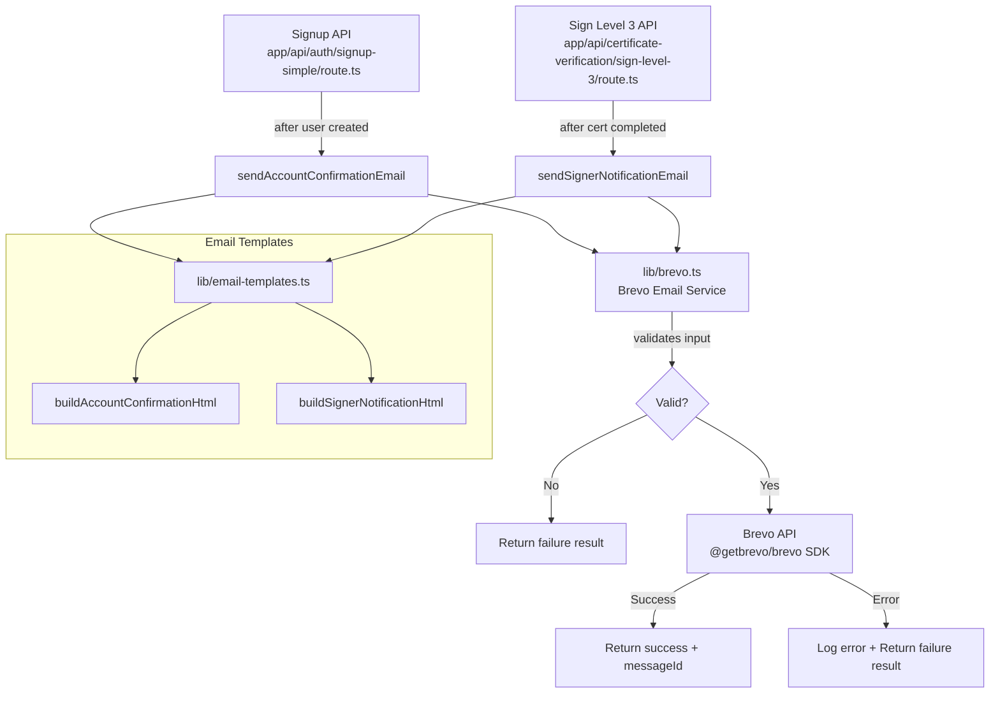

# Design Document: Brevo Email Notifications

## Overview

This design describes the integration of Brevo (formerly Sendinblue) as the transactional email service for the BMKG Calibration System. The implementation replaces the currently disabled nodemailer/Gmail approach in `lib/email.ts` with a new module using the `@getbrevo/brevo` SDK.

Two email use cases are implemented:
1. **Account Confirmation Email** — sent after successful user signup via the Signup API
2. **Signer Notification Email** — sent to the penandatangan when a certificate status changes to "completed" after BSrE signing via the Sign Level 3 API

The design prioritizes:
- Non-blocking email delivery (fire-and-forget pattern) so API responses are never delayed
- Graceful failure handling — email failures never cause API errors for the user
- Consistent HTML email templates with inline CSS for cross-client compatibility
- Input validation before making external API calls

## Architecture



### Key Architectural Decisions

1. **New module `lib/brevo.ts`** instead of modifying the existing `lib/email.ts`. The existing file uses nodemailer with Gmail SMTP and is entirely disabled. A clean new module avoids confusion and allows the old file to be removed later.

2. **`@getbrevo/brevo` package** (the official Brevo SDK) instead of `sib-api-v3-sdk` which is deprecated and no longer supported on npm. The `@getbrevo/brevo` package provides TypeScript types and uses the same Brevo v3 API.

3. **Fire-and-forget pattern** using `void sendEmail(...)` (no `await`) in the API routes. This ensures the API response is returned immediately without waiting for email delivery. Errors are caught internally and logged.

4. **Separate template module** (`lib/email-templates.ts`) to keep HTML generation logic testable independently from the Brevo API client.

5. **Result object pattern** — the send function returns `{ success: boolean; messageId?: string; error?: string }` rather than throwing exceptions, making error handling explicit and predictable.

## Components and Interfaces

### 1. Brevo Email Service (`lib/brevo.ts`)

The core email sending module that wraps the Brevo SDK.

```typescript
// lib/brevo.ts

export interface SendEmailParams {
  to: string;          // Recipient email address
  subject: string;     // Email subject (max 150 chars)
  htmlContent: string; // HTML body (max 1 MB)
}

export interface SendEmailResult {
  success: boolean;
  messageId?: string;  // Present on success
  error?: string;      // Present on failure
}

/**
 * Sends a transactional email via Brevo API.
 * Validates inputs before calling the API.
 * Never throws — always returns a result object.
 */
export async function sendEmail(params: SendEmailParams): Promise<SendEmailResult>;
```

### 2. Email Templates (`lib/email-templates.ts`)

Pure functions that generate HTML email content. No side effects, fully testable.

```typescript
// lib/email-templates.ts

/**
 * Wraps content in the shared BMKG email template structure.
 * Header: gradient with "BMKG - Sistem Kalibrasi" + "Direktorat Data dan Komputasi"
 * Footer: "© 2025 BMKG - Direktorat Data dan Komputasi"
 * All CSS is inline.
 */
export function wrapInEmailTemplate(contentHtml: string): string;

/**
 * Builds the account confirmation email HTML body.
 */
export function buildAccountConfirmationHtml(params: {
  userName: string;
}): string;

/**
 * Builds the signer notification email HTML body.
 */
export function buildSignerNotificationHtml(params: {
  certificateNumber: string;
  completionDateTime: string; // Pre-formatted in Indonesian locale
  viewUrl: string;
}): string;
```

### 3. Integration Points

#### Signup API Integration (`app/api/auth/signup-simple/route.ts`)

After the user is successfully created in Supabase, the route fires off the confirmation email without awaiting:

```typescript
// After successful signup, fire-and-forget email
void sendAccountConfirmationEmail(email, userData?.name || '');
```

New helper function:

```typescript
async function sendAccountConfirmationEmail(email: string, name: string): Promise<void> {
  try {
    const html = buildAccountConfirmationHtml({ userName: name });
    const result = await sendEmail({
      to: email,
      subject: 'Konfirmasi Akun - Sistem Kalibrasi BMKG',
      htmlContent: html,
    });
    if (!result.success) {
      console.error(`[signup] Failed to send confirmation email to ${email}: ${result.error}`);
    }
  } catch (error) {
    console.error(`[signup] Unexpected error sending confirmation email to ${email}:`, error);
  }
}
```

#### Sign Level 3 API Integration (`app/api/certificate-verification/sign-level-3/route.ts`)

After the certificate status is updated to "completed", the route fires off the signer notification:

```typescript
// After successful signing, fire-and-forget notification
void sendSignerNotification(cert.id, cert.no_certificate, cert.authorized_by);
```

New helper function:

```typescript
async function sendSignerNotification(
  certificateId: number,
  certificateNumber: string,
  authorizedByUserId: string
): Promise<void> {
  try {
    // Fetch penandatangan email from personel table
    const { data: personel } = await supabaseAdmin
      .from('personel')
      .select('email')
      .eq('id', authorizedByUserId)
      .single();

    if (!personel?.email) {
      console.warn(`[sign-level-3] No email found for authorized_by user ${authorizedByUserId}, skipping notification`);
      return;
    }

    const completionDateTime = new Date().toLocaleDateString('id-ID', {
      day: '2-digit', month: 'long', year: 'numeric',
      hour: '2-digit', minute: '2-digit', timeZone: 'Asia/Jakarta',
    }) + ' WIB';

    const viewUrl = `${process.env.NEXT_PUBLIC_SITE_URL || 'http://localhost:3000'}/certificates/${certificateId}/view`;

    const html = buildSignerNotificationHtml({
      certificateNumber,
      completionDateTime,
      viewUrl,
    });

    const result = await sendEmail({
      to: personel.email,
      subject: `Sertifikat Terbit - ${certificateNumber}`,
      htmlContent: html,
    });

    if (!result.success) {
      console.error(`[sign-level-3] Failed to send signer notification to ${personel.email}: ${result.error}`);
    }
  } catch (error) {
    console.error(`[sign-level-3] Unexpected error sending signer notification for cert ${certificateId}:`, error);
  }
}
```

## Data Models

### Environment Variables

| Variable | Required | Description |
|----------|----------|-------------|
| `BREVO_API_KEY` | Yes | Brevo API key for authentication |
| `NEXT_PUBLIC_SITE_URL` | Yes (existing) | Base URL for constructing certificate view links |

### SendEmailParams

| Field | Type | Constraints |
|-------|------|-------------|
| `to` | `string` | Must be a valid email format, non-empty |
| `subject` | `string` | Max 150 characters |
| `htmlContent` | `string` | Max 1 MB (1,048,576 bytes) |

### SendEmailResult

| Field | Type | Description |
|-------|------|-------------|
| `success` | `boolean` | Whether the email was sent successfully |
| `messageId` | `string \| undefined` | Brevo message ID on success |
| `error` | `string \| undefined` | Error description on failure |

### Personel Table (existing)

Relevant fields for this feature:

| Column | Type | Usage |
|--------|------|-------|
| `id` | `uuid` | Matches `authorized_by` on certificate |
| `email` | `string \| null` | Recipient for signer notification |
| `name` | `string` | Display name |

### Email Sender Configuration

| Field | Value |
|-------|-------|
| Email | `noreplysimkalnmkg@gmail.com` |
| Name | `BMKG Sistem Kalibrasi` |


## Correctness Properties

*A property is a characteristic or behavior that should hold true across all valid executions of a system — essentially, a formal statement about what the system should do. Properties serve as the bridge between human-readable specifications and machine-verifiable correctness guarantees.*

### Property 1: Invalid email rejection

*For any* string that is empty or does not match a valid email format (missing `@`, missing domain, whitespace-only, etc.), calling `sendEmail` with that string as the recipient SHALL return a failure result with an error message indicating invalid recipient, and the Brevo API SHALL NOT be called.

**Validates: Requirements 1.5**

### Property 2: Error containment

*For any* error thrown by the Brevo API (regardless of error type, message content, or structure), the `sendEmail` function SHALL catch the error and return `{ success: false, error: <message> }` without propagating an unhandled exception to the caller.

**Validates: Requirements 1.7**

### Property 3: Account confirmation template includes user name

*For any* non-empty user name string, calling `buildAccountConfirmationHtml({ userName })` SHALL produce HTML output that contains the provided user name.

**Validates: Requirements 2.2**

### Property 4: Signer notification template includes dynamic content

*For any* certificate number string and any valid URL string, calling `buildSignerNotificationHtml({ certificateNumber, completionDateTime, viewUrl })` SHALL produce HTML output that contains both the certificate number and the view URL.

**Validates: Requirements 3.2, 3.5**

### Property 5: Signer notification subject line format

*For any* certificate number string, the subject line for the signer notification email SHALL be exactly `"Sertifikat Terbit - "` concatenated with the certificate number.

**Validates: Requirements 3.4**

### Property 6: Template structure ordering

*For any* content HTML string passed to `wrapInEmailTemplate`, the output SHALL contain the header section (with "BMKG - Sistem Kalibrasi") appearing before the content string, which in turn appears before the footer section (with "© 2025 BMKG").

**Validates: Requirements 4.1, 4.5**

### Property 7: No embedded stylesheets

*For any* set of valid template parameters, the HTML output of both `buildAccountConfirmationHtml` and `buildSignerNotificationHtml` SHALL NOT contain `<style` tags or `<link` tags with `rel="stylesheet"`. All styling SHALL be applied via inline `style` attributes only.

**Validates: Requirements 4.4**

### Property 8: Valid inputs produce success result

*For any* valid email address, subject string (≤150 characters), and HTML body (≤1 MB), when the Brevo API mock returns a successful response with a message ID, the `sendEmail` function SHALL return `{ success: true, messageId: <id> }`.

**Validates: Requirements 1.4**

## Error Handling

### Brevo Service (`lib/brevo.ts`)

| Error Condition | Handling | User Impact |
|----------------|----------|-------------|
| `BREVO_API_KEY` missing/empty | Return `{ success: false, error: 'Missing BREVO_API_KEY configuration' }` | None — email silently skipped |
| Invalid recipient email | Return `{ success: false, error: 'Invalid recipient email address' }` | None — email silently skipped |
| Subject exceeds 150 chars | Truncate to 150 characters (defensive) | Email sent with truncated subject |
| HTML body exceeds 1 MB | Return `{ success: false, error: 'Email body exceeds maximum size' }` | None — email silently skipped |
| Brevo API network error | Catch, log with `console.error`, return failure result | None — email silently skipped |
| Brevo API 4xx/5xx response | Catch, log with `console.error`, return failure result | None — email silently skipped |

### Signup API Integration

| Error Condition | Handling | User Impact |
|----------------|----------|-------------|
| Email send fails | Log error, continue with success response | User gets successful signup response |
| Template generation throws | Caught by try/catch in helper, logged | User gets successful signup response |

### Sign Level 3 API Integration

| Error Condition | Handling | User Impact |
|----------------|----------|-------------|
| Personel record has no email | Log warning, skip email send | User gets successful signing response |
| Personel query fails | Caught by try/catch in helper, logged | User gets successful signing response |
| Email send fails | Log error, continue | User gets successful signing response |

### Logging Strategy

All email-related logs follow this pattern:
- **Success**: No log (reduce noise)
- **Validation failure**: `console.warn` with context
- **API failure**: `console.error` with recipient email and error message
- **Missing data**: `console.warn` with the missing field and relevant ID

## Testing Strategy

### Property-Based Tests (using `fast-check` with Jest)

Property-based tests will use the `fast-check` library to generate random inputs and verify universal properties. Each property test runs a minimum of 100 iterations.

**Library**: `fast-check` (well-maintained, TypeScript-native, integrates with Jest)

**Test file**: `lib/__tests__/brevo.property.test.ts` and `lib/__tests__/email-templates.property.test.ts`

Each property test is tagged with:
```
// Feature: brevo-email-notifications, Property {N}: {property_text}
```

**Properties to implement**:
1. Invalid email rejection — generate random non-email strings, verify rejection
2. Error containment — generate random errors, verify they're caught
3. Account confirmation template includes user name — generate random names
4. Signer notification template includes dynamic content — generate random cert numbers and URLs
5. Signer notification subject line format — generate random cert numbers
6. Template structure ordering — generate random content strings
7. No embedded stylesheets — generate random template params
8. Valid inputs produce success result — generate valid emails, subjects, bodies

### Unit Tests (example-based, with Jest)

**Test files**: `lib/__tests__/brevo.test.ts`, `lib/__tests__/email-templates.test.ts`

| Test | Validates |
|------|-----------|
| sendEmail returns failure when BREVO_API_KEY is missing | Req 1.8 |
| sendEmail uses correct sender address | Req 1.3 |
| sendEmail logs error details on API failure | Req 1.6 |
| Account confirmation email has correct subject | Req 2.4 |
| Account confirmation email includes BMKG branding | Req 2.3 |
| Signer notification includes formatted date with WIB | Req 3.3 |
| Template footer contains copyright text | Req 4.3 |
| Template header contains system name and subtitle | Req 4.2 |

### Integration Tests

**Test files**: `app/api/auth/signup-simple/__tests__/route.test.ts`, `app/api/certificate-verification/sign-level-3/__tests__/route.test.ts`

| Test | Validates |
|------|-----------|
| Signup API calls sendEmail after successful user creation | Req 2.1 |
| Signup API returns success even when email fails | Req 2.5 |
| Signup API logs email failure | Req 2.6 |
| Signup API sends email without blocking response | Req 2.7 |
| Sign Level 3 API sends notification after cert completion | Req 3.1 |
| Sign Level 3 API returns success even when email fails | Req 3.6 |
| Sign Level 3 API logs email failure | Req 3.7 |
| Sign Level 3 API queries personel for email | Req 3.8 |
| Sign Level 3 API skips email when personel has no email | Req 3.9 |
| Sign Level 3 API sends email without blocking response | Req 3.10 |

### Test Configuration

- Property tests: minimum 100 iterations per property (`fc.assert(property, { numRuns: 100 })`)
- Mocking: Brevo SDK is mocked in all unit/property tests; Supabase is mocked in integration tests
- Environment: Tests use `jest.replaceProperty` or `jest.mock` for env vars
- Coverage target: 70% (matching existing `jest.config.js` thresholds)

### Dependencies to Add

```json
{
  "dependencies": {
    "@getbrevo/brevo": "^2.0.0"
  },
  "devDependencies": {
    "fast-check": "^3.0.0"
  }
}
```
