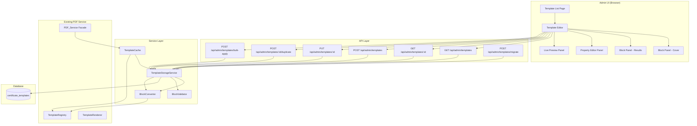
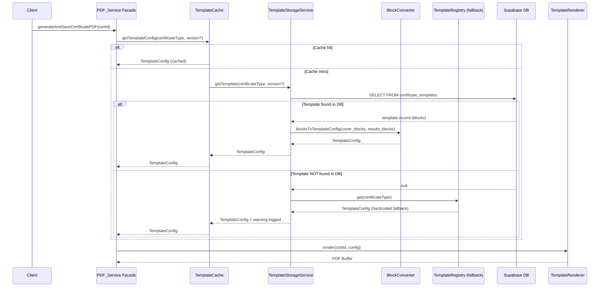
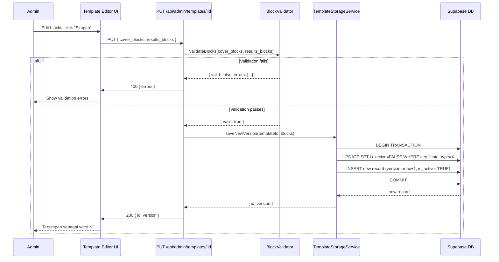

# Design: Certificate Template Editor

## Overview

This design extends the existing Flexible Certificate PDF Service with a database-backed template storage layer and a block-based visual editor. The current system stores 13 template configurations as TypeScript modules in `lib/pdf-service/templates/`. This feature adds:

1. **Database Storage** — Templates stored as JSONB block arrays in a `certificate_templates` table, enabling runtime modification without redeployment.
2. **Block-Based Editor** — Admin UI at `/admin/templates` with drag-and-drop block arrangement, per-block property editors, and live preview.
3. **Bidirectional Conversion** — A conversion layer that transforms between the existing `TemplateConfig` TypeScript interface and the database block format, ensuring backward compatibility with the PDF renderer.
4. **Versioning** — Immutable version history per template, with version pinning for previously-issued certificates.

### Key Design Decisions

1. **Extend, don't replace, the existing PDF service** — The `TemplateRegistry` and `TemplateRenderer` remain unchanged. A new `DatabaseTemplateSource` sits upstream, converting DB blocks into `TemplateConfig` objects that feed into the existing pipeline.
2. **Block format as normalized TemplateConfig** — Each block maps to a specific section of `TemplateConfig`. The conversion is lossless and round-trippable.
3. **Server Components + API Routes** — The admin pages use Next.js App Router server components for initial data loading, with client components for the interactive editor. API routes handle mutations.
4. **Debounced live preview** — Preview re-renders on a 500ms debounce after block changes, using a lightweight HTML renderer (not Playwright) for speed.
5. **5-minute in-memory cache** — Template configs fetched from DB are cached to avoid repeated queries during batch PDF generation.

## Architecture



### Request Flow — PDF Generation with DB Templates



### Request Flow — Editor Save



## Components and Interfaces

### 1. TemplateStorageService (`lib/template-editor/storage-service.ts`)

Central service for all database operations on certificate templates.

```typescript
export interface TemplateRecord {
  id: string                    // UUID
  name: string
  certificate_type: CertificateType
  cover_blocks: BlockDefinition[]
  results_blocks: BlockDefinition[]
  version: number
  is_active: boolean
  created_at: string
  updated_at: string
}

export interface TemplateStorageService {
  // List all templates (latest active version per type)
  listTemplates(): Promise<TemplateRecord[]>
  
  // Get specific template by ID
  getTemplateById(id: string): Promise<TemplateRecord | null>
  
  // Get active template for a certificate type
  getActiveTemplate(certificateType: CertificateType): Promise<TemplateRecord | null>
  
  // Get specific version of a template
  getTemplateByVersion(certificateType: CertificateType, version: number): Promise<TemplateRecord | null>
  
  // Save new version (increments version, deactivates previous)
  saveNewVersion(templateId: string, blocks: { cover_blocks: BlockDefinition[], results_blocks: BlockDefinition[] }): Promise<TemplateRecord>
  
  // Create new template
  createTemplate(data: { name: string, certificate_type: CertificateType, cover_blocks: BlockDefinition[], results_blocks: BlockDefinition[] }): Promise<TemplateRecord>
  
  // Duplicate template
  duplicateTemplate(sourceId: string, newName: string): Promise<TemplateRecord>
  
  // Bulk apply blocks to multiple templates
  bulkApply(sourceId: string, targetIds: string[]): Promise<BulkOperationResult>
}

export interface BulkOperationResult {
  total: number
  succeeded: number
  failed: Array<{ templateId: string; templateName: string; error: string }>
}
```

### 2. BlockConverter (`lib/template-editor/block-converter.ts`)

Bidirectional conversion between `TemplateConfig` and database block format.

```typescript
export interface BlockConverter {
  // Convert TemplateConfig → database blocks
  templateConfigToBlocks(config: TemplateConfig): {
    cover_blocks: BlockDefinition[]
    results_blocks: BlockDefinition[]
  }
  
  // Convert database blocks → TemplateConfig
  blocksToTemplateConfig(
    certificateType: CertificateType,
    coverBlocks: BlockDefinition[],
    resultsBlocks: BlockDefinition[]
  ): TemplateConfig
}
```

### 3. BlockValidator (`lib/template-editor/block-validator.ts`)

Validates block structures against type-specific schemas.

```typescript
export interface ValidationResult {
  valid: boolean
  errors: ValidationError[]
}

export interface ValidationError {
  blockId: string
  blockType: string
  field: string
  message: string
}

export interface BlockValidator {
  validateBlocks(coverBlocks: BlockDefinition[], resultsBlocks: BlockDefinition[]): ValidationResult
  validateBlock(block: BlockDefinition): ValidationError[]
  getRequiredProperties(blockType: BlockType): string[]
}
```

### 4. TemplateCache (`lib/template-editor/template-cache.ts`)

In-memory cache with 5-minute TTL for template configs used during PDF rendering.

```typescript
export interface TemplateCache {
  get(certificateType: CertificateType, version?: number): TemplateConfig | null
  set(certificateType: CertificateType, config: TemplateConfig, version?: number): void
  invalidate(certificateType: CertificateType): void
  invalidateAll(): void
}
```

### 5. API Routes

| Route | Method | Description |
|-------|--------|-------------|
| `/api/admin/templates` | GET | List all templates (active versions) |
| `/api/admin/templates` | POST | Create new template |
| `/api/admin/templates/[id]` | GET | Get template by ID with blocks |
| `/api/admin/templates/[id]` | PUT | Save new version of template |
| `/api/admin/templates/[id]/duplicate` | POST | Duplicate template |
| `/api/admin/templates/bulk-apply` | POST | Apply source blocks to targets |
| `/api/admin/templates/migrate` | POST | Run migration from TypeScript files |
| `/api/admin/templates/[id]/versions` | GET | List all versions of a template |

### 6. UI Components

```
app/admin/templates/
├── page.tsx                          # Template list (Server Component)
├── layout.tsx                        # Admin layout with auth guard
├── [id]/
│   └── page.tsx                      # Template editor page
└── components/
    ├── TemplateList.tsx              # Template list with actions
    ├── TemplateEditor.tsx           # Main editor orchestrator (Client)
    ├── BlockPanel.tsx               # Draggable block list
    ├── BlockItem.tsx                # Single block in the list
    ├── BlockPropertyEditor.tsx      # Dynamic property form
    ├── LivePreview.tsx              # Preview panel
    ├── AddBlockDropdown.tsx         # Block type selector
    ├── BulkApplyDialog.tsx          # Bulk operation modal
    ├── SaveButton.tsx               # Save with version info
    └── property-editors/
        ├── HeaderBlockEditor.tsx
        ├── TitleBlockEditor.tsx
        ├── SectionTableBlockEditor.tsx
        ├── QrCodeBlockEditor.tsx
        ├── FooterTextBlockEditor.tsx
        ├── ResultsTableBlockEditor.tsx
        ├── SpacerBlockEditor.tsx
        ├── AuthorizationBlockEditor.tsx
        ├── RepeatingHeaderBlockEditor.tsx
        ├── RepeatingFooterBlockEditor.tsx
        └── EndMarkerBlockEditor.tsx
```

## Data Models

### Database Schema

```sql
-- New table: certificate_templates
CREATE TABLE certificate_templates (
  id UUID PRIMARY KEY DEFAULT gen_random_uuid(),
  name VARCHAR(255) NOT NULL,
  certificate_type VARCHAR(50) NOT NULL,
  cover_blocks JSONB NOT NULL DEFAULT '[]'::jsonb,
  results_blocks JSONB NOT NULL DEFAULT '[]'::jsonb,
  version INTEGER NOT NULL DEFAULT 1,
  is_active BOOLEAN NOT NULL DEFAULT TRUE,
  created_at TIMESTAMPTZ NOT NULL DEFAULT NOW(),
  updated_at TIMESTAMPTZ NOT NULL DEFAULT NOW(),
  
  -- Constraints
  CONSTRAINT unique_type_version UNIQUE (certificate_type, version),
  CONSTRAINT valid_cover_blocks CHECK (jsonb_typeof(cover_blocks) = 'array'),
  CONSTRAINT valid_results_blocks CHECK (jsonb_typeof(results_blocks) = 'array')
);

-- Index for common queries
CREATE INDEX idx_templates_type_active ON certificate_templates (certificate_type, is_active)
  WHERE is_active = TRUE;
CREATE INDEX idx_templates_type_version ON certificate_templates (certificate_type, version DESC);

-- Add template_version to certificate table (existing)
ALTER TABLE certificate ADD COLUMN template_version INTEGER;
```

### Block Definition Types

```typescript
// ─── Block Types ─────────────────────────────────────────────────────────────

export type CoverBlockType = 
  | 'header' 
  | 'title' 
  | 'section-table' 
  | 'authorization' 
  | 'qr-code' 
  | 'footer-text' 
  | 'spacer'

export type ResultsBlockType = 
  | 'repeating-header' 
  | 'results-table' 
  | 'repeating-footer' 
  | 'end-marker'

export type BlockType = CoverBlockType | ResultsBlockType

// ─── Block Definition ────────────────────────────────────────────────────────

export interface BlockDefinition {
  id: string              // UUID, unique within template
  type: BlockType
  properties: BlockProperties
  order: number           // Position in array (0-based)
}

// ─── Block Properties (discriminated by type) ────────────────────────────────

export type BlockProperties = 
  | HeaderBlockProperties
  | TitleBlockProperties
  | SectionTableBlockProperties
  | AuthorizationBlockProperties
  | QrCodeBlockProperties
  | FooterTextBlockProperties
  | SpacerBlockProperties
  | RepeatingHeaderBlockProperties
  | ResultsTableBlockProperties
  | RepeatingFooterBlockProperties
  | EndMarkerBlockProperties

export interface HeaderBlockProperties {
  agencyName: string
  labName: string
  logoPath: string
  borderStyle: 'double' | 'single' | 'none'
  accreditationNumber?: string
  accreditationBody?: string
  accreditationScope?: string
  balaiName?: string
  balaiAddress?: string
  balaiLogoPath?: string
}

export interface TitleBlockProperties {
  titleId: string         // e.g. "SERTIFIKAT KALIBRASI"
  titleEn: string         // e.g. "CALIBRATION CERTIFICATE"
}

export interface SectionTableBlockProperties {
  headingId: string
  headingEn: string
  sectionId: string       // e.g. "instrument-details"
  fields: Array<{
    labelId: string
    labelEn: string
    dataKey: string
    widthLabel?: string
    widthValue?: string
  }>
}

export interface AuthorizationBlockProperties {
  showAccreditation: boolean
  showTraceability: boolean
  showValidityDates: boolean
}

export interface QrCodeBlockProperties {
  position: 'top-left' | 'top-right' | 'bottom-left' | 'bottom-right' | 'cover-bottom-left' | 'cover-bottom-right'
  size: 'small' | 'medium' | 'large'
}

export interface FooterTextBlockProperties {
  formCode: string
  signatureNote: string
  edition?: string
}

export interface SpacerBlockProperties {
  height: number          // in pixels
  unit: 'px' | 'mm'
}

export interface RepeatingHeaderBlockProperties {
  agencyName: string
  labName: string
  logoPath: string
  borderStyle: 'double' | 'single' | 'none'
}

export interface ResultsTableBlockProperties {
  columns: Array<{
    header: string
    dataKey: string
    width: string         // e.g. "20%", "100px"
  }>
  showUncertainty: boolean
  oneSensorPerPage: boolean
}

export interface RepeatingFooterBlockProperties {
  formCode: string
  showQRCode: boolean
  qrPosition: 'bottom-left' | 'bottom-right'
  officeAddress: string
  signatureNote: string
}

export interface EndMarkerBlockProperties {
  text: string            // e.g. "--- Akhir Sertifikat ---"
}
```

### Block-to-TemplateConfig Mapping

The conversion maps blocks to `TemplateConfig` fields as follows:

| Block Type | TemplateConfig Field |
|-----------|---------------------|
| `header` | `config.header` + `config.styling.headerBorderStyle` |
| `title` | `config.coverPage.titleId`, `config.coverPage.titleEn` |
| `section-table` | `config.coverPage.sections[]` |
| `authorization` | `config.coverPage.showAccreditation/Traceability/ValidityDates` |
| `qr-code` | `config.footer.showQRCode`, `config.footer.qrPosition` |
| `footer-text` | `config.footer.formCode`, `config.footer.signatureNote` |
| `spacer` | (layout-only, not mapped to TemplateConfig) |
| `repeating-header` | `config.resultsPage.headerRepeat` = true, header data |
| `results-table` | `config.resultsPage.showUncertainty`, `config.resultsPage.oneSensorPerPage` |
| `repeating-footer` | `config.resultsPage.footerRepeat` = true, footer data |
| `end-marker` | (layout-only marker) |

### File Structure

```
lib/template-editor/
├── index.ts                    # Public exports
├── types.ts                    # Block types and interfaces
├── storage-service.ts          # Database CRUD operations
├── block-converter.ts          # TemplateConfig ↔ blocks conversion
├── block-validator.ts          # Block validation logic
├── template-cache.ts           # In-memory cache (5min TTL)
├── migration.ts                # TypeScript → DB migration
└── block-schemas.ts            # Required properties per block type

app/admin/templates/
├── page.tsx                    # List page (Server Component)
├── layout.tsx                  # Auth guard layout
├── [id]/
│   └── page.tsx                # Editor page
└── components/                 # All UI components (see above)

app/api/admin/templates/
├── route.ts                    # GET (list) + POST (create)
├── migrate/
│   └── route.ts                # POST (run migration)
├── bulk-apply/
│   └── route.ts                # POST (bulk operation)
└── [id]/
    ├── route.ts                # GET + PUT
    ├── duplicate/
    │   └── route.ts            # POST
    └── versions/
        └── route.ts            # GET (version history)
```

## Correctness Properties

*A property is a characteristic or behavior that should hold true across all valid executions of a system — essentially, a formal statement about what the system should do. Properties serve as the bridge between human-readable specifications and machine-verifiable correctness guarantees.*

### Property 1: Template config round-trip (TemplateConfig → blocks → TemplateConfig)

*For any* valid `TemplateConfig` object, converting it to block format (`templateConfigToBlocks`) and then converting back (`blocksToTemplateConfig`) SHALL produce a `TemplateConfig` that is deeply equal to the original (excluding layout-only blocks like `spacer`).

**Validates: Requirements 8.2, 10.2, 10.5**

### Property 2: Block validation correctly identifies invalid blocks

*For any* block with a known `BlockType` and a randomly omitted subset of its required properties, the `BlockValidator` SHALL return validation errors listing every missing required property name for that block type.

**Validates: Requirements 1.2, 2.4, 2.5**

### Property 3: Active version retrieval returns highest version

*For any* set of template records for a given `certificate_type` with varying version numbers and `is_active` flags, `getActiveTemplate` SHALL return the record with `is_active=TRUE` and the highest `version` number, or null if no active record exists.

**Validates: Requirements 1.4**

### Property 4: Version save invariant

*For any* existing template with version history, saving a new version SHALL result in: (a) the new record having `version = max(existing_versions) + 1`, and (b) exactly one record with `is_active=TRUE` for that `certificate_type` (the newly saved one).

**Validates: Requirements 6.1, 6.2**

### Property 5: Version immutability

*For any* sequence of save operations on templates of the same `certificate_type`, all previously created version records SHALL remain in the database with their original `cover_blocks` and `results_blocks` unchanged.

**Validates: Requirements 6.3**

### Property 6: Block reorder preserves all blocks

*For any* array of blocks and any valid reorder operation (moving block from index `source` to index `destination`), the resulting array SHALL contain exactly the same set of blocks (by id) with updated `order` values reflecting the new positions.

**Validates: Requirements 4.2**

### Property 7: Block deletion preserves remaining blocks

*For any* array of blocks and any valid block id to delete, the resulting array SHALL contain all original blocks except the deleted one, with `order` values re-normalized to be contiguous starting from 0.

**Validates: Requirements 4.5**

### Property 8: Template duplication preserves block configuration

*For any* template record, duplicating it SHALL produce a new record with: (a) a different `id`, (b) the specified new `name`, (c) `cover_blocks` and `results_blocks` deeply equal to the source, and (d) `version = 1`.

**Validates: Requirements 3.4**

### Property 9: Bulk apply creates correct new versions for all targets

*For any* source template and list of target template IDs, a successful bulk apply SHALL create a new version for each target with `cover_blocks` and `results_blocks` identical to the source template's blocks.

**Validates: Requirements 7.2**

### Property 10: Bulk apply partial failure resilience

*For any* bulk apply operation where some targets fail (e.g., due to validation errors), the operation SHALL still succeed for all non-failing targets, and the result SHALL accurately report which targets succeeded and which failed with reasons.

**Validates: Requirements 7.5**

### Property 11: Version pinning for certificate re-rendering

*For any* certificate record with a recorded `template_version`, requesting PDF generation SHALL use the template at that specific version, not the latest active version.

**Validates: Requirements 6.5**

### Property 12: Migration idempotency

*For any* state where some templates already exist in the database, running the migration function SHALL skip existing templates without modifying them and only insert templates that don't yet exist.

**Validates: Requirements 10.3**

### Property 13: Block structure invariant

*For any* block created through the editor (add operation), the resulting `BlockDefinition` SHALL have a non-empty `id` (UUID format), a valid `type` from the `BlockType` union, a `properties` object, and an `order` value that is a non-negative integer.

**Validates: Requirements 2.3**

## Error Handling

### Error Categories

| Component | Error Condition | Response |
|-----------|----------------|----------|
| Auth Guard | Non-admin user accesses `/admin/templates` | Redirect to `/dashboard` with "Akses ditolak" toast |
| Block Validator | Missing required properties | 400 with list of missing fields per block |
| Block Validator | Invalid block type | 400 with "Tipe blok tidak dikenal: {type}" |
| Storage Service | Template not found by ID | 404 "Template tidak ditemukan" |
| Storage Service | Duplicate certificate_type + version | 409 "Versi sudah ada" (race condition) |
| Block Converter | Unrecognized block type during conversion | Skip block, log warning, continue |
| Template Cache | Cache miss | Transparent fallback to DB query |
| Bulk Apply | Individual target failure | Continue others, report failure in result |
| Migration | Template already exists | Skip, log "Template {type} sudah ada, dilewati" |
| Migration | Round-trip validation failure | Log error, mark template as needing review |
| PDF Service | DB template not found | Fallback to TypeScript hardcoded config + warning |
| PDF Service | Recorded version not found | Use latest active version + warning |
| Live Preview | Invalid block config | Show inline error on the problematic block |

### Error Response Format (API)

```typescript
interface ApiErrorResponse {
  error: string                    // Human-readable message (Indonesian)
  code?: string                    // Machine-readable code
  details?: ValidationError[]      // For validation errors
}
```

### Unsaved Changes Protection

The editor tracks a `isDirty` state. When the user attempts to navigate away:
- Browser `beforeunload` event shows native confirmation dialog
- Next.js router navigation intercepted with custom dialog: "Anda memiliki perubahan yang belum disimpan. Simpan atau buang perubahan?"

## Testing Strategy

### Unit Tests (Jest)

Focus on pure logic components:

1. **BlockConverter** — Test conversion in both directions:
   - FC template → blocks → FC template (round-trip)
   - LC template → blocks → LC template (with accreditation)
   - Balai template → blocks (with balai-specific fields)
   - Edge cases: empty sections, missing optional fields

2. **BlockValidator** — Test validation rules:
   - Valid block passes validation
   - Missing required field → error with field name
   - Invalid block type → rejection
   - Each block type's required properties

3. **TemplateStorageService** — Test with mocked Supabase:
   - List templates returns active versions
   - Save increments version correctly
   - Duplicate creates independent copy
   - Bulk apply handles partial failures

4. **TemplateCache** — Test caching behavior:
   - Cache hit returns stored value
   - Cache miss returns null
   - Entries expire after 5 minutes
   - Invalidation removes entries

### Property-Based Tests (fast-check)

The project uses `fast-check` v4.7.0. Property tests validate universal correctness:

- **Minimum 100 iterations** per property test
- Each test tagged with: `Feature: certificate-template-editor, Property {N}: {title}`
- Properties 1-8, 12-13 test pure functions (converter, validator, reorder/delete logic) — fast and cheap
- Properties 4-5, 9-11 test storage logic — use mocked database

**Key generators needed:**
- `arbitraryTemplateConfig()` — generates valid `TemplateConfig` objects
- `arbitraryBlockDefinition(type)` — generates valid blocks per type
- `arbitraryCoverBlocks()` — generates valid cover block arrays
- `arbitraryResultsBlocks()` — generates valid results block arrays
- `arbitraryReorderOp(arrayLength)` — generates valid source/dest indices

### Integration Tests

1. **API Route Tests** — Test full request/response cycle:
   - GET `/api/admin/templates` returns template list
   - PUT `/api/admin/templates/:id` creates new version
   - POST `/api/admin/templates/:id/duplicate` creates copy
   - POST `/api/admin/templates/bulk-apply` applies to targets
   - Auth: non-admin gets 403

2. **Migration Test** — Run migration against test DB:
   - All 13 templates imported as version 1
   - Re-running migration skips existing
   - Round-trip validation passes for all templates

3. **PDF Service Integration** — Verify DB templates produce same output:
   - Migrate FC template to DB
   - Generate PDF using DB template
   - Compare with PDF from TypeScript template (structural equivalence)

### Test File Structure

```
__tests__/
├── template-editor/
│   ├── block-converter.test.ts          # Unit + property tests
│   ├── block-validator.test.ts          # Unit + property tests
│   ├── storage-service.test.ts          # Unit tests (mocked DB)
│   ├── template-cache.test.ts           # Unit tests
│   ├── migration.test.ts               # Integration tests
│   └── properties/
│       └── template-editor.property.test.ts  # All property-based tests
├── api/
│   └── admin-templates.test.ts          # API route tests
```
