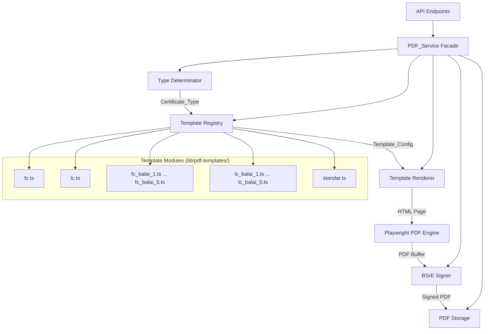
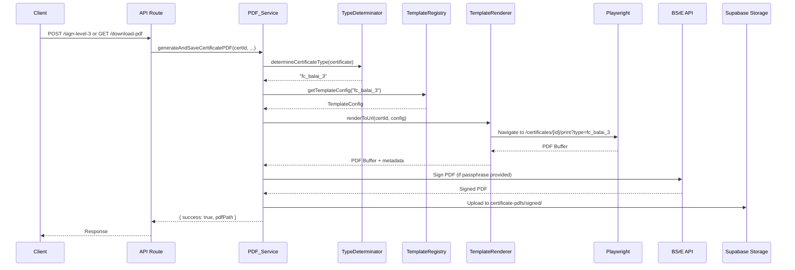

# Design: Flexible Certificate PDF Service

## Overview

This design transforms the monolithic PDF generation system into a modular, template-driven architecture. The current system hardcodes a single certificate layout (FC type) in one React page and one helper function. The new architecture introduces a **Template Registry** pattern where each certificate type (FC, LC, Balai variants, Standar) is defined as an independent, declarative configuration module.

The core idea: certificate rendering becomes a pipeline of `Certificate Data → Type Determination → Template Lookup → HTML Rendering → PDF Generation`. Each stage is decoupled, testable, and extensible without modifying existing code.

### Key Design Decisions

1. **Server-side template configs (TypeScript modules)** over database-stored templates — templates change with code deployments, not at runtime. This keeps them version-controlled and type-safe.
2. **Retain Playwright-based rendering** — the existing approach works well for pixel-perfect PDF output with complex layouts. Switching to a PDF library (like pdfkit) would require rewriting all layouts.
3. **Template isolation via config objects** — each template is a self-contained config that the renderer consumes. No inheritance between templates to avoid coupling.
4. **Backward-compatible wrapper** — the existing `generateAndSaveCertificatePDF` function signature is preserved as a facade over the new service.

## Architecture



### Request Flow



## Components and Interfaces

### 1. Type Determinator (`lib/pdf-service/type-determinator.ts`)

Pure function that maps certificate data to a Certificate_Type string.

```typescript
export type CertificateType =
  | 'fc' | 'lc'
  | 'fc_balai_1' | 'fc_balai_2' | 'fc_balai_3' | 'fc_balai_4' | 'fc_balai_5'
  | 'lc_balai_1' | 'lc_balai_2' | 'lc_balai_3' | 'lc_balai_4' | 'lc_balai_5'
  | 'standar'

export interface CertificateTypeInput {
  calibration_place?: 'FC' | 'LC' | null
  calibration_kind?: 'FC' | 'LC' | null
  balai_id?: number | null
  is_standard?: boolean | null
  certificate_type?: 'sert' | 's_ket' | null
}

/**
 * Determines the Certificate_Type based on priority rules:
 * 1. is_standard = true → 'standar'
 * 2. balai_id not null → '{place}_balai_{id}'
 * 3. calibration_place without balai → 'fc' or 'lc'
 * 4. fallback → 'fc' (with warning logged)
 */
export function determineCertificateType(input: CertificateTypeInput): CertificateType
```

### 2. Template Registry (`lib/pdf-service/template-registry.ts`)

Manages registration and lookup of template configurations.

```typescript
export interface TemplateRegistry {
  register(type: CertificateType, config: TemplateConfig): void
  get(type: CertificateType): TemplateConfig
  has(type: CertificateType): boolean
  listTypes(): CertificateType[]
}

/**
 * Creates a new registry instance. 
 * The default export is a singleton pre-loaded with all 13 types.
 */
export function createTemplateRegistry(): TemplateRegistry
export const defaultRegistry: TemplateRegistry
```

### 3. Template Config (`lib/pdf-service/types.ts`)

Declarative configuration for each certificate type.

```typescript
export interface TemplateConfig {
  type: CertificateType
  header: HeaderConfig
  coverPage: CoverPageConfig
  resultsPage: ResultsPageConfig
  footer: FooterConfig
  styling: StylingConfig
}

export interface HeaderConfig {
  agencyName: string          // e.g. "BADAN METEOROLOGI KLIMATOLOGI DAN GEOFISIKA"
  labName: string             // e.g. "LABORATORIUM KALIBRASI BMKG"
  logoPath: string            // Path to logo image
  accreditationNumber?: string // e.g. "LK-095-IDN" (LC only)
  accreditationBody?: string   // e.g. "KAN" (LC only)
  accreditationScope?: string  // LC only
  balaiName?: string          // e.g. "BALAI BESAR MKG WILAYAH I"
  balaiAddress?: string
  balaiLogoPath?: string
}

export interface CoverPageConfig {
  titleId: string             // e.g. "SERTIFIKAT KALIBRASI"
  titleEn: string             // e.g. "CALIBRATION CERTIFICATE"
  showAccreditation: boolean
  showTraceability: boolean   // standar type only
  showValidityDates: boolean  // standar type only
  sections: CoverSection[]
}

export interface CoverSection {
  id: string                  // e.g. "instrument-details", "owner-identification"
  headingId: string           // Indonesian heading
  headingEn: string           // English heading (italic)
  fields: CoverField[]
}

export interface CoverField {
  labelId: string
  labelEn: string
  dataKey: string             // Key to extract from certificate data
  widthLabel?: string         // e.g. "30%"
  widthValue?: string         // e.g. "65%"
}

export interface ResultsPageConfig {
  headerRepeat: boolean       // Whether header repeats on each page
  footerRepeat: boolean       // Whether footer repeats on each page
  showUncertainty: boolean    // LC type shows uncertainty column
  oneSensorPerPage: boolean   // FC renders one sensor per page
}

export interface FooterConfig {
  formCode: string            // e.g. "F/IKK 7.8.2" for FC
  showQRCode: boolean
  qrPosition: 'bottom-left' | 'bottom-right'
  officeAddress: string
  signatureNote: string       // e.g. "Dokumen ini ditandatangani secara elektronik..."
}

export interface StylingConfig {
  fontFamily: string
  baseFontSize: string        // e.g. "11pt"
  headerBorderStyle: 'double' | 'single' | 'none'
  pageMargin: string          // Internal padding e.g. "5mm"
}
```

### 4. Template Renderer (`lib/pdf-service/template-renderer.ts`)

Renders a certificate using its template config. Generates the URL for Playwright to navigate to.

```typescript
export interface RenderResult {
  pdfBuffer: Buffer
  metadata: {
    fileSize: number
    fileName: string
    certificateType: CertificateType
  }
}

export interface TemplateRenderer {
  render(
    certificateId: number,
    config: TemplateConfig,
    options?: RenderOptions
  ): Promise<RenderResult>
}

export interface RenderOptions {
  simulateSigned?: boolean
  timeoutMs?: number          // Default: 120000
  publicBaseUrl?: string
}
```

### 5. PDF Service Facade (`lib/pdf-service/index.ts`)

Orchestrates the full pipeline and maintains backward compatibility.

```typescript
export interface PdfServiceResult {
  success: boolean
  pdfPath?: string
  error?: string
  signed?: boolean
}

/**
 * Drop-in replacement for the existing generateAndSaveCertificatePDF.
 * Same signature, same return type.
 */
export async function generateAndSaveCertificatePDF(
  certificateId: number,
  userId?: string,
  passphrase?: string,
  simulateSigned?: boolean
): Promise<PdfServiceResult>
```

### 6. Print Page (Updated) (`app/certificates/[id]/print/page.tsx`)

The existing print page is refactored to accept a `type` query parameter and render the appropriate template. It reads the TemplateConfig from a client-accessible JSON endpoint or embedded data attribute.

```typescript
// New query params:
// ?pdf=true&type=fc_balai_3&render_token=...&render_ts=...

// The page uses the type param to load the correct layout components
// Falls back to 'fc' if no type specified (backward compat)
```

## Data Models

### Certificate Table (existing, with new fields)

```sql
-- Existing fields used by type determination:
calibration_place  VARCHAR  -- 'FC' or 'LC'
calibration_kind   VARCHAR  -- 'FC' or 'LC' (legacy)
certificate_type   VARCHAR  -- 'sert' or 's_ket'

-- New fields (added via migration):
balai_id           INTEGER  NULL  -- 1-5, references which Balai
is_standard        BOOLEAN  DEFAULT FALSE  -- marks standard certificates
```

### Template Config File Structure

```
lib/pdf-service/
├── index.ts                    # PDF_Service facade (generateAndSaveCertificatePDF)
├── type-determinator.ts        # determineCertificateType()
├── template-registry.ts        # TemplateRegistry class
├── template-renderer.ts        # TemplateRenderer (Playwright orchestration)
├── types.ts                    # All TypeScript interfaces
└── templates/
    ├── index.ts                # Auto-registers all templates
    ├── fc.ts                   # FC template config
    ├── lc.ts                   # LC template config
    ├── fc-balai-1.ts           # FC Balai 1 config
    ├── fc-balai-2.ts           # FC Balai 2 config
    ├── fc-balai-3.ts           # FC Balai 3 config
    ├── fc-balai-4.ts           # FC Balai 4 config
    ├── fc-balai-5.ts           # FC Balai 5 config
    ├── lc-balai-1.ts           # LC Balai 1 config
    ├── lc-balai-2.ts           # LC Balai 2 config
    ├── lc-balai-3.ts           # LC Balai 3 config
    ├── lc-balai-4.ts           # LC Balai 4 config
    ├── lc-balai-5.ts           # LC Balai 5 config
    ├── standar.ts              # Standard certificate config
    └── shared/
        ├── balai-data.ts       # Balai names, addresses, logos
        └── base-styles.ts     # Shared styling constants
```

### Balai Data Structure

```typescript
// lib/pdf-service/templates/shared/balai-data.ts
export interface BalaiInfo {
  id: number
  name: string              // e.g. "BALAI BESAR MKG WILAYAH I"
  address: string
  logoPath: string
}

export const BALAI_DATA: Record<number, BalaiInfo> = {
  1: { id: 1, name: "BALAI BESAR MKG WILAYAH I", address: "...", logoPath: "/logos/balai-1.png" },
  2: { id: 2, name: "BALAI BESAR MKG WILAYAH II", address: "...", logoPath: "/logos/balai-2.png" },
  3: { id: 3, name: "BALAI BESAR MKG WILAYAH III", address: "...", logoPath: "/logos/balai-3.png" },
  4: { id: 4, name: "BALAI BESAR MKG WILAYAH IV", address: "...", logoPath: "/logos/balai-4.png" },
  5: { id: 5, name: "BALAI BESAR MKG WILAYAH V", address: "...", logoPath: "/logos/balai-5.png" },
}
```

## Correctness Properties

*A property is a characteristic or behavior that should hold true across all valid executions of a system — essentially, a formal statement about what the system should do. Properties serve as the bridge between human-readable specifications and machine-verifiable correctness guarantees.*

### Property 1: Template registration round-trip

*For any* valid TemplateConfig with a unique CertificateType, registering it in the TemplateRegistry and then looking it up by that type SHALL return a config identical to the one registered.

**Validates: Requirements 1.1, 1.2**

### Property 2: Unknown type lookup produces informative error

*For any* string that is not a registered CertificateType, calling `get()` on the TemplateRegistry SHALL throw an error whose message contains both the requested type name and the complete list of currently registered types.

**Validates: Requirements 1.4**

### Property 3: Incomplete config validation rejects with missing field names

*For any* TemplateConfig that is missing one or more required fields (header, coverPage, resultsPage, footer, or styling), attempting to register it SHALL be rejected with an error message that lists every missing field name.

**Validates: Requirements 1.5, 2.6**

### Property 4: Duplicate registration rejection

*For any* CertificateType that is already registered, attempting to register a new config with the same type SHALL be rejected with an error indicating the type is already registered.

**Validates: Requirements 1.6**

### Property 5: Template isolation

*For any* two distinct registered CertificateTypes A and B, modifying the TemplateConfig for type A in the registry SHALL not change the TemplateConfig returned for type B.

**Validates: Requirements 2.5, 2.7, 6.5**

### Property 6: Certificate type determination follows priority rules

*For any* certificate data input, the `determineCertificateType` function SHALL return:
- `'standar'` if `is_standard` is true (regardless of other fields)
- `'{place}_balai_{id}'` if `balai_id` is not null (where place is lowercase calibration_place, defaulting to 'fc')
- `'lc'` if `calibration_place` is 'LC' and `balai_id` is null
- `'fc'` in all other cases (including null calibration_place)

**Validates: Requirements 9.1, 9.2, 9.3, 9.4, 9.5, 9.6, 10.2, 10.3**

### Property 7: Rendered output reflects template config header

*For any* valid TemplateConfig and certificate data, the HTML output produced by the TemplateRenderer SHALL contain the `agencyName` and `labName` strings from the config's header section.

**Validates: Requirements 2.2, 2.3, 4.1, 5.1, 6.1**

### Property 8: QR code inclusion when public_id present

*For any* certificate with a non-null `public_id` and a TemplateConfig where `footer.showQRCode` is true, the rendered output SHALL contain a QR code element whose encoded URL includes the certificate's `public_id`.

**Validates: Requirements 8.4**

## Error Handling

### Error Categories and Responses

| Stage | Error Condition | Response |
|-------|----------------|----------|
| Type Determination | `calibration_place` null, `is_standard` false | Log warning, use default `'fc'` |
| Template Lookup | Unknown CertificateType | Error with type name + available types |
| Template Validation | Missing required config fields | Error listing missing fields |
| Rendering | Playwright navigation failure | Error with stage='rendering', URL attempted |
| Rendering | Content not ready within timeout | Error with stage='rendering', timeout details |
| PDF Generation | Playwright PDF generation failure | Error with stage='pdf_generation' |
| BSrE Signing | NIK not found | Error code `NIK_MISSING` |
| BSrE Signing | Invalid passphrase | Error "Passphrase salah" |
| BSrE Signing | Timeout (120s) | Error code `BSRE_TIMEOUT` |
| BSrE Signing | Connection failure | Error code `BSRE_CONNECTION_FAILED` |
| Storage | Upload failure | Error with storage details |

### Error Response Structure

```typescript
interface PdfServiceError {
  success: false
  error: string               // Human-readable message
  code?: string               // Machine-readable error code
  stage?: 'type_determination' | 'template_lookup' | 'rendering' | 'pdf_generation' | 'signing' | 'storage'
  certificateType?: string    // The type that was being processed
  details?: Record<string, any>
}
```

### Timeout Strategy

- **Overall process timeout**: 120 seconds (matches existing behavior)
- **Playwright navigation**: 60 seconds
- **Content readiness wait**: 30 seconds
- **QR code rendering**: 15 seconds
- **BSrE API call**: 120 seconds (separate from rendering timeout)

### Graceful Degradation

- If Balai logo is missing → render without logo, log warning
- If accreditation data missing for LC → render without accreditation section, log warning
- If traceability data missing for standar → render section with "belum dilengkapi" placeholder
- If `calibration_place` is null → default to FC template with warning

## Testing Strategy

### Unit Tests (Jest)

Focus on pure logic components:

1. **Type Determinator** — test all priority rules with specific examples:
   - FC with no balai → `'fc'`
   - LC with no balai → `'lc'`
   - FC with balai_id=3 → `'fc_balai_3'`
   - is_standard=true with balai_id=2 → `'standar'` (priority)
   - All null fields → `'fc'` (fallback)

2. **Template Registry** — test registration, lookup, validation:
   - Register valid config → lookup succeeds
   - Register incomplete config → validation error
   - Lookup unregistered type → informative error
   - Duplicate registration → rejection

3. **Template Config validation** — test schema enforcement

### Property-Based Tests (fast-check)

The project already uses `fast-check` (v4.7.0). Property tests will validate universal correctness:

- **Minimum 100 iterations** per property test
- Each test tagged with: `Feature: flexible-certificate-pdf-service, Property {N}: {title}`
- Properties 1-6 test pure functions (registry, type determinator) — fast and cheap to run
- Properties 7-8 test rendering output — may use lightweight HTML string checks rather than full Playwright

### Integration Tests

1. **PDF Generation end-to-end** — generate PDF for each of the 13 types, verify:
   - Output is valid PDF (starts with `%PDF-`)
   - Page dimensions are A4
   - No encryption/password

2. **BSrE signing flow** — mock BSrE API, verify:
   - Correct multipart form data sent
   - Signed PDF stored correctly
   - Error handling for various BSrE failure modes

3. **API endpoint compatibility** — verify existing endpoints still work:
   - `GET /api/certificates/[id]/download-pdf` returns PDF
   - `GET /api/certificates/[id]/pdf` returns stored signed PDF
   - `generateAndSaveCertificatePDF()` returns `{ success, pdfPath }`

### Test File Structure

```
__tests__/
├── pdf-service/
│   ├── type-determinator.test.ts        # Unit + property tests
│   ├── template-registry.test.ts        # Unit + property tests
│   ├── template-renderer.test.ts        # Unit tests (mocked Playwright)
│   ├── pdf-service-facade.test.ts       # Integration tests
│   └── properties/
│       └── pdf-service.property.test.ts # All property-based tests
```
