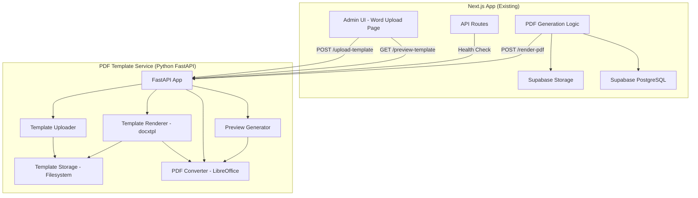
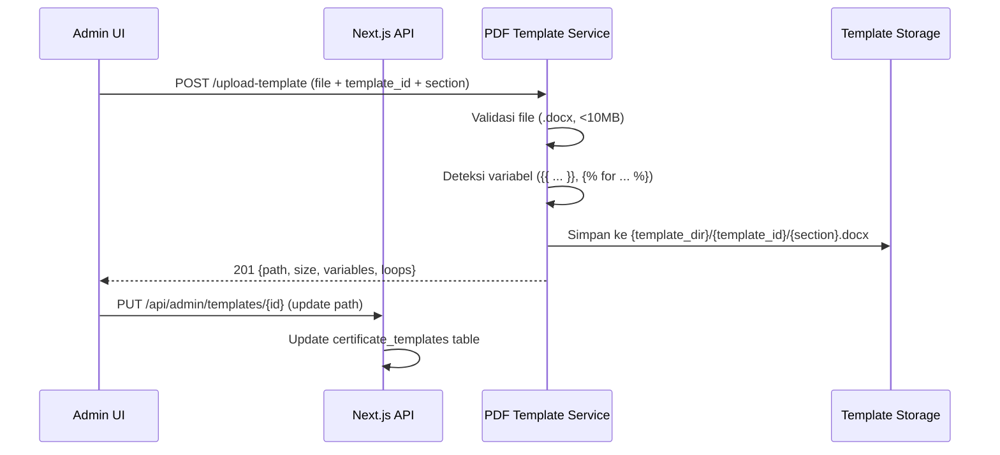
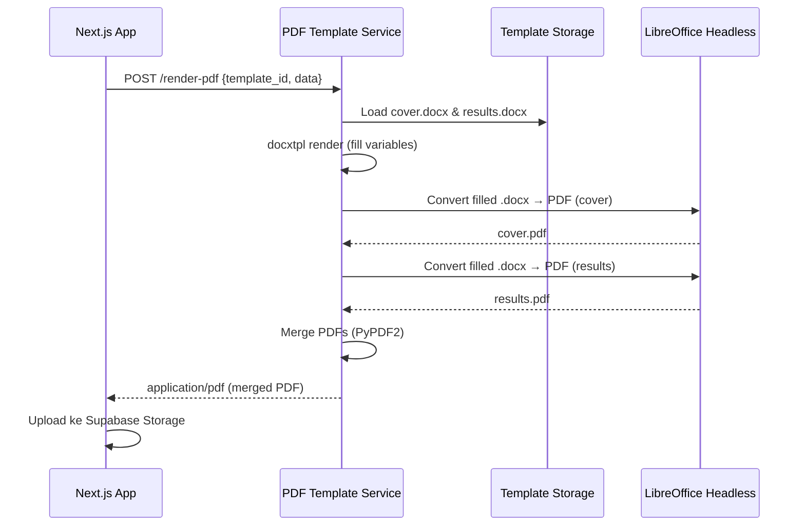

# Design: Python PDF Template Service

## Overview

Desain ini memperkenalkan microservice Python FastAPI (`pdf-template-service`) yang menggantikan pipeline konversi DOCX→HTML→PDF berbasis mammoth.js + Playwright. Pendekatan baru menggunakan **docxtpl** (library Python berbasis Jinja2) untuk mengisi variabel langsung ke file .docx template, lalu **LibreOffice headless** untuk konversi ke PDF. Hasilnya adalah PDF dengan layout yang identik dengan dokumen Word asli — tanpa kehilangan formatting akibat konversi HTML.

### Keputusan Desain Utama

1. **Microservice terpisah (Python FastAPI)** — Library docxtpl dan python-docx hanya tersedia di ekosistem Python. Memisahkan service memungkinkan scaling independen dan isolasi dependency.
2. **File .docx sebagai source of truth** — Template disimpan sebagai file .docx di filesystem, bukan HTML di database. Admin mengedit template di Microsoft Word, upload langsung.
3. **LibreOffice headless untuk konversi PDF** — Menghasilkan PDF dengan fidelitas tinggi terhadap layout Word. Tidak memerlukan browser headless.
4. **Backward compatibility via fallback** — Jika template belum dimigrasikan (kolom `cover_template_path` kosong), sistem tetap menggunakan Playwright HTML rendering.
5. **Pembersihan kode lama** — Semua kode TipTap editor dan mammoth.js converter dihapus untuk mengurangi technical debt.

## Architecture



### Request Flow: Upload Template



### Request Flow: Render PDF



## Components and Interfaces

### 1. FastAPI Application (`app/main.py`)

Entry point microservice. Mengkonfigurasi CORS, routes, dan startup checks.

```python
from fastapi import FastAPI
from fastapi.middleware.cors import CORSMiddleware

app = FastAPI(
    title="PDF Template Service",
    version="1.0.0",
    description="Microservice untuk rendering template .docx ke PDF"
)

# CORS configuration dari environment variable
app.add_middleware(
    CORSMiddleware,
    allow_origins=get_cors_origins(),  # dari PDF_CORS_ORIGINS
    allow_methods=["GET", "POST"],
    allow_headers=["*"],
)
```

### 2. Health Check Endpoint (`app/routes/health.py`)

```python
from pydantic import BaseModel

class HealthResponse(BaseModel):
    status: str  # "ok"
    version: str  # semver string
    libreoffice_available: bool

@router.get("/health", response_model=HealthResponse)
async def health_check() -> HealthResponse:
    """Cek status service dan ketersediaan LibreOffice."""
    ...
```

### 3. Upload Template Endpoint (`app/routes/upload.py`)

```python
from pydantic import BaseModel
from fastapi import UploadFile, Form
from enum import Enum

class SectionEnum(str, Enum):
    cover = "cover"
    results = "results"

class UploadResponse(BaseModel):
    path: str
    size_bytes: int
    variables: list[str]  # detected {{ ... }} variables
    loops: list[str]      # detected  loops

@router.post("/upload-template", status_code=201, response_model=UploadResponse)
async def upload_template(
    file: UploadFile,
    template_id: str = Form(...),
    section: SectionEnum = Form(...)
) -> UploadResponse:
    """Upload file .docx template ke filesystem."""
    ...
```

### 4. Render PDF Endpoint (`app/routes/render.py`)

```python
from pydantic import BaseModel
from fastapi.responses import Response

class RenderRequest(BaseModel):
    template_id: str
    data: dict

@router.post("/render-pdf")
async def render_pdf(request: RenderRequest) -> Response:
    """Render template dengan data dan kembalikan PDF."""
    ...
```

### 5. Preview Template Endpoint (`app/routes/preview.py`)

```python
@router.get("/preview-template")
async def preview_template(
    template_id: str,
    section: SectionEnum
) -> Response:
    """Generate preview PNG dari halaman pertama template."""
    ...
```

### 6. Template Renderer (`app/services/template_renderer.py`)

Komponen inti yang mengisi variabel ke template .docx menggunakan docxtpl.

```python
from docxtpl import DocxTemplate
from pathlib import Path

class TemplateRenderer:
    """Mengisi template .docx dengan data menggunakan docxtpl (Jinja2)."""

    def __init__(self, template_dir: Path):
        self.template_dir = template_dir

    def render(self, template_id: str, section: str, data: dict) -> Path:
        """
        Render template dengan data.
        Returns: Path ke file .docx yang sudah diisi (temporary file).
        """
        ...

    def detect_variables(self, template_path: Path) -> tuple[list[str], list[str]]:
        """
        Deteksi semua variabel dan loop dalam template.
        Returns: (variables, loops)
        """
        ...
```

### 7. PDF Converter (`app/services/pdf_converter.py`)

Mengkonversi .docx ke PDF via LibreOffice headless.

```python
from pathlib import Path

class PDFConverter:
    """Konversi .docx ke PDF menggunakan LibreOffice headless."""

    TIMEOUT_SECONDS: int = 30

    async def convert(self, docx_path: Path) -> Path:
        """
        Konversi file .docx ke PDF.
        Returns: Path ke file PDF hasil konversi.
        Raises: ConversionError jika LibreOffice gagal atau timeout.
        """
        ...

    async def convert_to_png(self, docx_path: Path, dpi: int = 150) -> Path:
        """
        Konversi halaman pertama .docx ke PNG untuk preview.
        Returns: Path ke file PNG.
        """
        ...

    def is_available(self) -> bool:
        """Cek apakah LibreOffice terinstall dan dapat diakses."""
        ...
```

### 8. PDF Merger (`app/services/pdf_merger.py`)

Menggabungkan multiple PDF menjadi satu file.

```python
from pathlib import Path

class PDFMerger:
    """Menggabungkan beberapa file PDF menjadi satu."""

    def merge(self, pdf_paths: list[Path]) -> Path:
        """
        Gabungkan PDF files sesuai urutan.
        Returns: Path ke merged PDF (temporary file).
        """
        ...
```

### 9. Preview Cache (`app/services/preview_cache.py`)

Cache preview PNG berdasarkan modified time file template.

```python
from pathlib import Path
from datetime import datetime

class PreviewCache:
    """Cache preview PNG berdasarkan file modification time."""

    def __init__(self, cache_dir: Path):
        self.cache_dir = cache_dir

    def get(self, template_path: Path) -> Path | None:
        """Return cached preview jika masih valid, None jika expired."""
        ...

    def put(self, template_path: Path, preview_path: Path) -> None:
        """Simpan preview ke cache."""
        ...

    def invalidate(self, template_path: Path) -> None:
        """Hapus cache untuk template tertentu."""
        ...
```

### 10. Configuration (`app/config.py`)

```python
from pydantic_settings import BaseSettings
from pathlib import Path

class Settings(BaseSettings):
    pdf_service_port: int = 8000
    pdf_template_dir: Path = Path("./templates")
    pdf_cors_origins: str = ""

    class Config:
        env_prefix = ""
        env_file = ".env"

    @property
    def cors_origins_list(self) -> list[str]:
        """Parse comma-separated origins."""
        if not self.pdf_cors_origins:
            return []
        return [o.strip() for o in self.pdf_cors_origins.split(",") if o.strip()]

settings = Settings()
```

## Data Models

### Database Migration: Tambah Kolom Template Path

```sql
-- Migration: Add template file path columns to certificate_templates
-- Kolom baru untuk menyimpan path file .docx template

ALTER TABLE certificate_templates
  ADD COLUMN cover_template_path VARCHAR(500) DEFAULT NULL,
  ADD COLUMN results_template_path VARCHAR(500) DEFAULT NULL;

-- Comment untuk dokumentasi
COMMENT ON COLUMN certificate_templates.cover_template_path IS
  'Path relatif ke file .docx template cover (e.g. "tmpl-uuid-123/cover.docx")';
COMMENT ON COLUMN certificate_templates.results_template_path IS
  'Path relatif ke file .docx template hasil (e.g. "tmpl-uuid-123/results.docx")';
```

### API Request/Response Schemas

#### POST /upload-template

**Request:** `multipart/form-data`
| Field | Type | Required | Description |
|-------|------|----------|-------------|
| file | File (.docx) | Yes | File template Word |
| template_id | string | Yes | ID template (alfanumerik, hyphen, underscore, max 100 char) |
| section | enum | Yes | "cover" atau "results" |

**Response 201:**
```json
{
  "path": "tmpl-abc-123/cover.docx",
  "size_bytes": 45230,
  "variables": ["nama_alat", "merk", "tipe", "no_seri", "nomor_sertifikat"],
  "loops": ["sensors", "hasil_kalibrasi"]
}
```

#### POST /render-pdf

**Request:** `application/json`
```json
{
  "template_id": "tmpl-abc-123",
  "data": {
    "nama_alat": "Barometer Digital",
    "merk": "Vaisala",
    "tipe": "PTB330",
    "no_seri": "S1234567",
    "nomor_sertifikat": "LK.01.01/2024/001",
    "tanggal_kalibrasi": "15 Januari 2024",
    "sensors": [
      {
        "sensor_nama": "Sensor Tekanan",
        "hasil_kalibrasi": [
          {"titik_ukur": "900", "pembacaan": "900.1", "koreksi": "0.1", "ketidakpastian": "0.05"}
        ]
      }
    ]
  }
}
```

**Response 200:** `application/pdf` (binary PDF file)

#### GET /preview-template

**Query Parameters:**
| Param | Type | Required | Description |
|-------|------|----------|-------------|
| template_id | string | Yes | ID template |
| section | enum | Yes | "cover" atau "results" |

**Response 200:** `image/png` (binary PNG image)

#### GET /health

**Response 200:**
```json
{
  "status": "ok",
  "version": "1.0.0",
  "libreoffice_available": true
}
```

### Error Response Schema

```json
{
  "detail": "Pesan error yang menjelaskan masalah",
  "code": "TEMPLATE_NOT_FOUND",
  "field": "template_id"
}
```

### Struktur Folder Service

```
services/pdf-template-service/
├── Dockerfile
├── docker-compose.yml
├── requirements.txt
├── pyproject.toml
├── README.md
├── .env.example
├── templates/                    # Template Storage (mounted volume)
│   └── {template_id}/
│       ├── cover.docx
│       └── results.docx
├── cache/                        # Preview cache directory
│   └── {template_id}/
│       ├── cover_preview.png
│       └── results_preview.png
├── app/
│   ├── __init__.py
│   ├── main.py                   # FastAPI app entry point
│   ├── config.py                 # Settings (env vars)
│   ├── routes/
│   │   ├── __init__.py
│   │   ├── health.py            # GET /health
│   │   ├── upload.py            # POST /upload-template
│   │   ├── render.py            # POST /render-pdf
│   │   └── preview.py          # GET /preview-template
│   ├── services/
│   │   ├── __init__.py
│   │   ├── template_renderer.py  # docxtpl rendering
│   │   ├── pdf_converter.py      # LibreOffice conversion
│   │   ├── pdf_merger.py         # PyPDF2 merge
│   │   ├── preview_cache.py      # PNG cache management
│   │   └── variable_detector.py  # Detect {{ }} and  in .docx
│   ├── models/
│   │   ├── __init__.py
│   │   └── schemas.py           # Pydantic request/response models
│   └── exceptions.py            # Custom exception classes
└── tests/
    ├── __init__.py
    ├── conftest.py              # Pytest fixtures
    ├── test_health.py
    ├── test_upload.py
    ├── test_render.py
    ├── test_preview.py
    ├── test_template_renderer.py
    ├── test_pdf_converter.py
    ├── test_variable_detector.py
    └── test_properties.py       # Property-based tests (Hypothesis)
```

### Dockerfile

```dockerfile
FROM python:3.12-slim

# Install LibreOffice headless dan dependensi
RUN apt-get update && apt-get install -y --no-install-recommends \
    libreoffice-writer \
    libreoffice-calc \
    poppler-utils \
    && rm -rf /var/lib/apt/lists/*

WORKDIR /app

COPY requirements.txt .
RUN pip install --no-cache-dir -r requirements.txt

COPY app/ ./app/

# Create directories
RUN mkdir -p /app/templates /app/cache

ENV PDF_SERVICE_PORT=8000
ENV PDF_TEMPLATE_DIR=/app/templates
ENV PDF_CORS_ORIGINS=""

EXPOSE 8000

CMD ["uvicorn", "app.main:app", "--host", "0.0.0.0", "--port", "8000"]
```

### Dependencies (`requirements.txt`)

```
fastapi==0.115.0
uvicorn[standard]==0.30.0
python-multipart==0.0.9
pydantic==2.9.0
pydantic-settings==2.5.0
docxtpl==0.18.0
python-docx==1.1.2
PyPDF2==3.0.1
pdf2image==1.17.0
Pillow==10.4.0
```


## Correctness Properties

*A property is a characteristic or behavior that should hold true across all valid executions of a system — essentially, a formal statement about what the system should do. Properties serve as the bridge between human-readable specifications and machine-verifiable correctness guarantees.*

### Property 1: Validasi template_id menerima yang valid dan menolak yang invalid

*For any* string yang hanya mengandung karakter alfanumerik, hyphen, atau underscore dengan panjang 1–100 karakter, validasi template_id SHALL menerimanya. *For any* string yang mengandung karakter lain atau panjangnya 0 atau >100, validasi SHALL menolaknya dengan error 400.

**Validates: Requirements 2.2, 2.10**

### Property 2: Upload menyimpan file pada path yang benar

*For any* valid template_id dan section (cover/results), setelah upload berhasil, file SHALL tersimpan di path `{template_dir}/{template_id}/{section}.docx` dan response path SHALL sesuai dengan lokasi file aktual.

**Validates: Requirements 2.1, 2.3**

### Property 3: Deteksi variabel menemukan semua placeholder

*For any* file .docx yang mengandung N buah Template_Variable (`{{ var }}`) dan M buah Loop_Variable (``), fungsi deteksi SHALL mengembalikan tepat N variabel dan M loop yang sesuai dengan yang ada di dokumen.

**Validates: Requirements 2.5, 2.6**

### Property 4: Rendering template mengisi variabel dengan benar

*For any* template .docx dengan variabel `{{ x }}` dan data dictionary yang mengandung key `x` dengan value `v`, hasil rendering SHALL mengandung value `v` di posisi yang sebelumnya ditempati placeholder `{{ x }}`.

**Validates: Requirements 3.2**

### Property 5: Loop rendering menghasilkan semua item

*For any* template dengan `` dan list berisi N item, hasil rendering SHALL mengandung tepat N iterasi konten loop, masing-masing berisi data dari item yang bersesuaian.

**Validates: Requirements 3.3**

### Property 6: Variabel yang tidak ada di data dirender sebagai string kosong

*For any* template dengan variabel `{{ x }}` dimana key `x` tidak ada dalam data dictionary yang dikirim, hasil rendering SHALL mengganti placeholder dengan string kosong tanpa menghasilkan error.

**Validates: Requirements 3.10**

### Property 7: Merge PDF mempertahankan jumlah halaman

*For any* dua file PDF valid dengan jumlah halaman P1 dan P2, hasil merge SHALL menghasilkan PDF dengan jumlah halaman tepat P1 + P2, dengan halaman dari PDF pertama muncul sebelum halaman dari PDF kedua.

**Validates: Requirements 3.5**

### Property 8: File temporary dibersihkan setelah render

*For any* request render-pdf (baik berhasil maupun gagal), setelah response dikirim, tidak SHALL ada file temporary (.docx terisi atau PDF intermediate) yang tersisa di direktori temporary.

**Validates: Requirements 3.12**

### Property 9: Preview cache valid berdasarkan modification time

*For any* file template, jika file tidak berubah (modification time sama), preview cache SHALL mengembalikan hasil yang sama tanpa konversi ulang. Jika file berubah (modification time lebih baru), cache SHALL di-invalidate dan preview baru SHALL digenerate.

**Validates: Requirements 4.6, 4.7**

### Property 10: Data mapping mengkonversi null menjadi string kosong

*For any* data sertifikat dari database dimana satu atau lebih field bernilai null, fungsi mapping SHALL menghasilkan object data dimana semua field null diganti dengan string kosong (""), dan field non-null tetap mempertahankan nilainya.

**Validates: Requirements 8.2, 8.3**

### Property 11: Routing PDF generation berdasarkan template path

*For any* template record, jika `cover_template_path` terisi (non-empty string), sistem SHALL menggunakan PDF_Template_Service. Jika `cover_template_path` kosong/NULL dan `cover_html` terisi (non-null), sistem SHALL menggunakan Playwright HTML rendering sebagai fallback.

**Validates: Requirements 6.4, 6.5, 6.7**

### Property 12: Konfigurasi port valid dalam range 1024-65535

*For any* nilai `PDF_SERVICE_PORT` yang merupakan integer dalam range 1024–65535, service SHALL menerima dan menggunakan port tersebut. *For any* nilai di luar range tersebut, service SHALL menolak konfigurasi dengan error.

**Validates: Requirements 1.1, 1.5**

## Error Handling

### Strategi Error Handling

Service menggunakan pendekatan **fail-fast dengan pesan informatif**. Setiap error dikategorikan dan dikembalikan dengan HTTP status code yang sesuai.

### Error Categories

| HTTP Status | Kategori | Kondisi |
|-------------|----------|---------|
| 400 | Validation Error | File bukan .docx, ukuran >10MB, template_id invalid, section invalid, request body tidak valid |
| 404 | Not Found | Template tidak ditemukan di filesystem |
| 500 | Internal Error | LibreOffice gagal konversi, error tak terduga |
| 503 | Service Unavailable | LibreOffice tidak terinstall/terdeteksi |

### Custom Exceptions

```python
class TemplateServiceError(Exception):
    """Base exception untuk PDF Template Service."""
    def __init__(self, message: str, code: str, status_code: int = 500):
        self.message = message
        self.code = code
        self.status_code = status_code

class ValidationError(TemplateServiceError):
    """Error validasi input (400)."""
    def __init__(self, message: str, field: str = None):
        super().__init__(message, "VALIDATION_ERROR", 400)
        self.field = field

class TemplateNotFoundError(TemplateServiceError):
    """Template tidak ditemukan (404)."""
    def __init__(self, template_id: str, section: str = None):
        msg = f"Template '{template_id}' tidak ditemukan"
        if section:
            msg += f" (section: {section})"
        super().__init__(msg, "TEMPLATE_NOT_FOUND", 404)

class ConversionError(TemplateServiceError):
    """LibreOffice gagal konversi (500)."""
    def __init__(self, detail: str = None):
        msg = "Gagal mengkonversi dokumen ke PDF"
        if detail:
            msg += f": {detail}"
        super().__init__(msg, "CONVERSION_ERROR", 500)

class LibreOfficeUnavailableError(TemplateServiceError):
    """LibreOffice tidak tersedia (503)."""
    def __init__(self):
        super().__init__(
            "LibreOffice tidak tersedia. Service tidak dapat mengkonversi dokumen.",
            "LIBREOFFICE_UNAVAILABLE",
            503
        )
```

### Global Exception Handler

```python
@app.exception_handler(TemplateServiceError)
async def template_service_error_handler(request, exc: TemplateServiceError):
    return JSONResponse(
        status_code=exc.status_code,
        content={
            "detail": exc.message,
            "code": exc.code,
            **({"field": exc.field} if hasattr(exc, 'field') and exc.field else {})
        }
    )
```

### Timeout Strategy

| Operasi | Timeout | Aksi jika timeout |
|---------|---------|-------------------|
| LibreOffice konversi per file | 30 detik | Raise ConversionError |
| Total render-pdf request | 60 detik | Return 500 |
| Preview generation | 30 detik | Return 500 |
| Health check | 2 detik | Return degraded status |

### Cleanup Strategy

File temporary dibersihkan menggunakan `try/finally` pattern:

```python
async def render_pdf(request: RenderRequest):
    temp_files: list[Path] = []
    try:
        # ... render logic, track temp files ...
        return Response(content=pdf_bytes, media_type="application/pdf")
    finally:
        for f in temp_files:
            f.unlink(missing_ok=True)
```

### Graceful Degradation

- **LibreOffice tidak tersedia**: Service tetap berjalan, health check mengembalikan `libreoffice_available: false`, endpoint render/preview mengembalikan 503.
- **Variabel tidak ada di data**: Template dirender dengan placeholder kosong (bukan error).
- **Template hanya punya satu section**: Render tanpa merge, kembalikan PDF tunggal.

## Testing Strategy

### Pendekatan Testing

Testing menggunakan **dual approach**: unit tests untuk logika murni dan property-based tests untuk validasi universal. Integration tests untuk end-to-end flow dengan LibreOffice.

### Unit Tests (pytest)

Fokus pada komponen logika murni tanpa dependency eksternal:

1. **Variable Detector** — deteksi {{ }} dan  dalam .docx
2. **Template Renderer** — rendering docxtpl dengan berbagai data
3. **Preview Cache** — cache hit/miss berdasarkan modification time
4. **Configuration** — parsing environment variables
5. **Validation** — template_id format, file type, file size
6. **Data Mapping** (Next.js side) — konversi data database ke format template

### Property-Based Tests (Hypothesis)

Library: **Hypothesis** (Python PBT library)
Minimum: **100 iterations** per property test

Setiap test di-tag dengan format:
`Feature: python-pdf-template-service, Property {N}: {property_text}`

Properties yang ditest:
- Property 1: Validasi template_id (pure function, fast)
- Property 2: Upload path construction (pure function, fast)
- Property 3: Variable detection (requires docxtpl, medium cost)
- Property 4: Template rendering (requires docxtpl, medium cost)
- Property 5: Loop rendering (requires docxtpl, medium cost)
- Property 6: Missing variables → empty string (requires docxtpl, medium cost)
- Property 7: PDF merge page count (requires PyPDF2, medium cost)
- Property 8: Temp file cleanup (requires filesystem, medium cost)
- Property 9: Preview cache (requires filesystem, fast)
- Property 10: Data mapping null→empty (pure function, fast)
- Property 11: Routing logic (pure function, fast)
- Property 12: Port validation (pure function, fast)

### Integration Tests (pytest + Docker)

Tests yang memerlukan LibreOffice:

1. **End-to-end render** — upload template, render dengan data, verify PDF valid
2. **Preview generation** — upload template, request preview, verify PNG dimensions
3. **Multi-section merge** — render cover + results, verify merged PDF
4. **Error scenarios** — template not found, invalid data, LibreOffice timeout

### Test untuk Next.js Side (Jest + fast-check)

Tests di sisi Next.js app:

1. **Data mapping** — konversi certificate data ke template variables
2. **Routing logic** — pilih service baru vs fallback Playwright
3. **Error handling** — response dari service errors
4. **Build verification** — `next build` berhasil setelah cleanup kode lama

### Struktur File Test

```
# Python service tests
services/pdf-template-service/tests/
├── conftest.py                    # Fixtures (sample .docx, mock data)
├── test_health.py                 # Health endpoint tests
├── test_upload.py                 # Upload endpoint tests
├── test_render.py                 # Render endpoint tests
├── test_preview.py                # Preview endpoint tests
├── test_template_renderer.py      # Unit tests for renderer
├── test_pdf_converter.py          # Integration tests (needs LibreOffice)
├── test_variable_detector.py      # Unit tests for detection
├── test_preview_cache.py          # Unit tests for cache
├── test_config.py                 # Configuration tests
└── test_properties.py             # All property-based tests (Hypothesis)

# Next.js side tests
__tests__/
├── pdf-service/
│   ├── data-mapping.test.ts       # Data mapping logic
│   ├── routing-logic.test.ts      # Service routing (new vs fallback)
│   └── pdf-service.property.test.ts  # Property tests (fast-check)
```

### Test Configuration

**Python (pytest + hypothesis):**
```ini
# pyproject.toml
[tool.pytest.ini_options]
testpaths = ["tests"]
asyncio_mode = "auto"

[tool.hypothesis]
max_examples = 100
deadline = 5000  # 5 seconds per example
```

**Next.js (jest + fast-check):**
```typescript
// Property tests use fast-check (already in devDependencies v4.7.0)
// Minimum 100 iterations: fc.assert(property, { numRuns: 100 })
```
