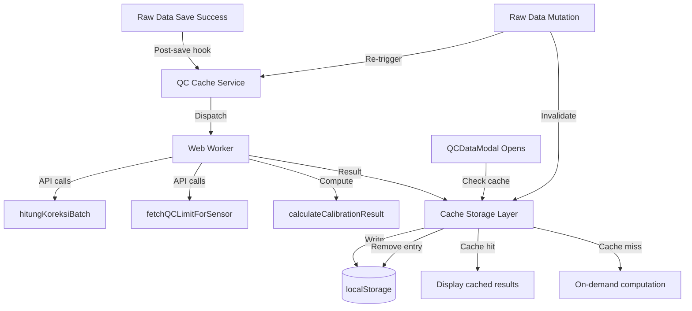

# Design Document: QC Data Caching

## Overview

This feature introduces a client-side caching layer for QC (Quality Control) computation results. Currently, every time the QCDataModal opens, it triggers sequential API calls (`hitungKoreksiBatch`, `fetchQCLimitForSensor`) and heavy computation (`calculateCalibrationResult`). This design moves computation to a background process triggered after raw data is saved, storing results in localStorage keyed by `session_id`, so the QC modal loads pre-computed results instantly.

The system consists of three main parts:
1. **QC Cache Service** — orchestrates background computation and cache management
2. **Cache Storage Layer** — handles localStorage read/write with serialization, validation, and eviction
3. **QCDataModal Integration** — modified modal that checks cache before falling back to on-demand computation

### Design Decisions

- **localStorage over IndexedDB**: localStorage is simpler and sufficient for our use case. Each cache entry is a JSON object with correction maps, QC limits, and calibration results — typically under 50KB per session. localStorage's 5-10MB limit accommodates dozens of sessions.
- **Web Worker for background computation**: The computation involves multiple API calls and CPU-intensive uncertainty calculations. A dedicated Web Worker prevents UI jank during background pre-computation.
- **Eager invalidation**: Any data mutation (insert/update/delete) immediately removes the cache entry rather than marking it stale. This ensures the user never sees outdated results.

## Architecture



### Data Flow

1. User saves raw data via `/api/raw-data` endpoint
2. On successful response, the draft-view page calls `qcCacheService.triggerComputation(sessionId)`
3. The cache service dispatches work to a Web Worker
4. The Web Worker fetches raw data, calls `hitungKoreksiBatch`, `fetchQCLimitForSensor`, and `calculateCalibrationResult`
5. Results are posted back to the main thread and stored in localStorage
6. When QCDataModal opens, it first checks `qcCacheService.get(sessionId)`
7. If cache hit → display immediately; if cache miss → existing on-demand flow

## Components and Interfaces

### QCCacheService (`lib/qc-cache-service.ts`)

The main orchestrator for cache operations.

```typescript
interface QCCacheService {
  /** Trigger background pre-computation for a session */
  triggerComputation(sessionId: string): void;

  /** Get cached entry, returns null if miss or invalid */
  get(sessionId: string): CacheEntry | null;

  /** Invalidate (remove) cache for a session and optionally re-compute */
  invalidate(sessionId: string, recompute?: boolean): void;

  /** Force refresh: invalidate + recompute, returns a Promise for the new entry */
  refresh(sessionId: string): Promise<CacheEntry>;

  /** Check if computation is in progress for a session */
  isComputing(sessionId: string): boolean;
}
```

### CacheStorageLayer (`lib/qc-cache-storage.ts`)

Handles localStorage operations with serialization, validation, and eviction.

```typescript
interface CacheStorageLayer {
  /** Read and validate a cache entry */
  read(sessionId: string): CacheEntry | null;

  /** Write a cache entry with eviction on QuotaExceededError */
  write(sessionId: string, entry: CacheEntry): boolean;

  /** Remove a cache entry */
  remove(sessionId: string): void;

  /** Get the storage key for a session */
  getKey(sessionId: string): string; // returns `qc_cache_${sessionId}`

  /** Serialize a Map to JSON-compatible array format */
  serializeMap(map: Map<string, number>): Array<[string, number]>;

  /** Deserialize JSON array back to Map */
  deserializeMap(data: Array<[string, number]>): Map<string, number>;

  /** Validate a parsed object has all required CacheEntry fields */
  validate(obj: unknown): obj is CacheEntry;
}
```

### QCComputeWorker (`workers/qc-compute.worker.ts`)

Web Worker that performs the actual computation off the main thread.

```typescript
// Messages TO the worker
interface ComputeRequest {
  type: 'compute';
  sessionId: string;
  // Worker will fetch raw data itself via fetch()
}

// Messages FROM the worker
interface ComputeResponse {
  type: 'result';
  sessionId: string;
  entry: CacheEntry;
}

interface ComputeError {
  type: 'error';
  sessionId: string;
  error: string;
}
```

### Modified QCDataModal Integration

The existing QCDataModal component will be modified to check cache first:

```typescript
// In QCDataModal.tsx, modify the data loading useEffect:
useEffect(() => {
  if (isOpen && sessionId) {
    const cached = qcCacheService.get(sessionId);
    if (cached) {
      // Use cached data directly
      setCorrectionMap(cacheStorage.deserializeMap(cached.correction_map));
      setQcLimits(cached.qc_limits);
      // Skip API calls
    } else {
      // Existing on-demand flow
      fetchRawData(sessionId);
    }
  }
}, [isOpen, sessionId]);
```

## Data Models

### CacheEntry

```typescript
interface CacheEntry {
  /** Serialized correction map: Array of [key, value] tuples */
  correction_map: Array<[string, number]>;

  /** QC limits per sensor ID */
  qc_limits: Record<string, QCLimit | null>;

  /** Calibration results per sensor group */
  calibration_results: Record<string, {
    uutAvg: number;
    correctionAvg: number;
    uncertainty: number;
  }>;

  /** ISO timestamp of when this cache entry was created */
  timestamp: string;

  /** Raw data row count at time of caching (for quick staleness check) */
  row_count: number;
}
```

### localStorage Key Format

```
qc_cache_{session_id}
```

Example: `qc_cache_abc123-def456-ghi789`

### Serialization Format

The `correction_map` field stores a JavaScript `Map<string, number>` as an array of tuples:

```json
{
  "correction_map": [["42:1013.25", 0.15], ["42:1000.0", -0.02]],
  "qc_limits": { "15": { "instrumentName": "Barometer", "rawLimit": "± 0.3", "limitValue": 0.3, "unit": "hPa", "masterQcId": 7 } },
  "calibration_results": { "15": { "uutAvg": 1013.1, "correctionAvg": 0.15, "uncertainty": 0.22 } },
  "timestamp": "2024-01-15T10:30:00.000Z",
  "row_count": 10
}
```

## Correctness Properties

*A property is a characteristic or behavior that should hold true across all valid executions of a system — essentially, a formal statement about what the system should do. Properties serve as the bridge between human-readable specifications and machine-verifiable correctness guarantees.*

### Property 1: Map Serialization Round-Trip

*For any* JavaScript `Map<string, number>` with valid string keys and finite number values, serializing it via `serializeMap()` and then deserializing via `deserializeMap()` SHALL produce a Map with identical entries — every key lookup on the deserialized Map returns the same value as the original.

**Validates: Requirements 3.3, 6.3**

### Property 2: Cache Equivalence

*For any* valid raw data set and session configuration, the QC results (correction_map, qc_limits, calibration_results) loaded from Cache_Storage SHALL be identical to the results produced by on-demand computation on the same raw data.

**Validates: Requirements 2.3, 1.3, 2.1**

### Property 3: Cache Entry Structure Invariant

*For any* session_id string, the cache key SHALL be `qc_cache_${session_id}`, and *for any* successfully stored CacheEntry, it SHALL contain all required fields: `correction_map` (array of tuples), `qc_limits` (object), `calibration_results` (object), and `timestamp` (ISO string).

**Validates: Requirements 3.1, 3.2**

### Property 4: Cache Invalidation on Data Mutation

*For any* session_id with an existing CacheEntry in localStorage, and *for any* data mutation event (insert, update, or delete) affecting that session_id, the CacheEntry SHALL be removed from localStorage after the invalidation call.

**Validates: Requirements 4.1, 4.2, 4.3**

### Property 5: LRU Eviction Ordering

*For any* set of CacheEntries in localStorage with distinct timestamps, when a QuotaExceededError forces eviction, the entries SHALL be removed in order from oldest timestamp to newest until the write succeeds.

**Validates: Requirements 5.1, 5.3**

### Property 6: Invalid Cache Entry Rejection

*For any* JSON value stored in localStorage under a `qc_cache_*` key that is missing one or more required fields (correction_map, qc_limits, calibration_results, timestamp) or contains malformed data, the `validate()` function SHALL return false, and the `read()` function SHALL remove the invalid entry and return null.

**Validates: Requirements 6.1, 6.2**

### Property 7: Refresh Replaces Cache

*For any* session_id, calling `refresh(sessionId)` SHALL result in the old CacheEntry being removed and a new CacheEntry being stored with a timestamp greater than or equal to the original entry's timestamp.

**Validates: Requirements 7.2**

## Error Handling

| Scenario | Handling |
|----------|----------|
| Network error during background computation | Log to console, do not store cache. Modal falls back to on-demand. |
| `hitungKoreksiBatch` API failure | Log error, skip correction map. Allow partial cache or fall back entirely. |
| `fetchQCLimitForSensor` failure | Log error, store null for that sensor's QC limit. Modal shows "No QC" badge. |
| localStorage `QuotaExceededError` | Evict oldest entries by timestamp. If still fails after full eviction, log warning and skip caching. |
| Malformed JSON in localStorage | Remove invalid entry, fall back to on-demand computation. |
| Web Worker crash/timeout | Catch error in main thread, log it, allow modal to use on-demand flow. |
| Session ID not found in raw_data | Worker returns empty result, do not cache. Modal shows "no data" state. |

## Testing Strategy

### Property-Based Tests (fast-check)

The project already has `fast-check` installed. Each correctness property will be implemented as a property-based test with minimum 100 iterations.

**Library**: `fast-check` (already in devDependencies)
**Runner**: Jest (already configured)
**Minimum iterations**: 100 per property

Property tests will be placed in `__tests__/qc-cache/` and tagged with comments referencing the design properties:

```typescript
// Feature: qc-data-caching, Property 1: Map Serialization Round-Trip
test.prop([fc.array(fc.tuple(fc.string(), fc.float()))])(
  'serializeMap then deserializeMap is identity',
  (entries) => { /* ... */ }
);
```

### Unit Tests (Jest)

Unit tests cover specific examples and edge cases:

- Cache service triggers computation after save (mock Web Worker)
- Modal uses cached data when available (mock localStorage)
- Modal falls back when no cache exists
- Error scenarios (network failure, worker crash)
- Refresh button triggers fresh computation
- Loading indicator shown during refresh
- QuotaExceededError with no other entries to evict → graceful degradation

### Integration Tests

- End-to-end flow: save raw data → background compute → open modal → see cached results
- Invalidation flow: save data → cache populated → update data → cache cleared → modal recomputes
- Web Worker communication: main thread ↔ worker message passing

### Test File Structure

```
__tests__/
  qc-cache/
    qc-cache-storage.test.ts       # Property tests for serialization, validation, eviction
    qc-cache-service.test.ts       # Unit tests for service orchestration
    qc-cache-integration.test.ts   # Integration tests for full flow
```
