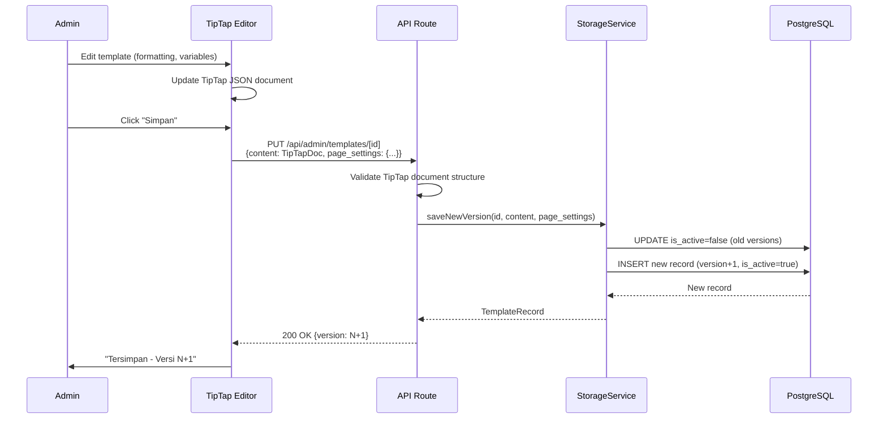
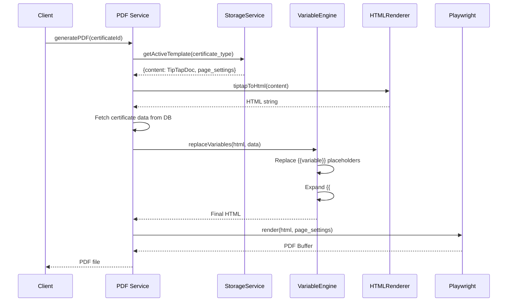

# Design Document: Rich Text Template Editor

## Overview

Fitur ini menggantikan block-based template editor yang ada di `/admin/templates` dengan editor WYSIWYG berbasis TipTap yang memberikan kontrol formatting penuh kepada admin. Pendekatan baru ini menggunakan konsep "mail merge" — admin mendesain template sertifikat secara visual lalu menyisipkan placeholder variabel (`{{nama_variabel}}`) yang diganti dengan data aktual saat generate PDF.

### Keputusan Arsitektur Utama

1. **TipTap (ProseMirror)** sebagai editor engine — mature, extensible, menyimpan dokumen sebagai JSON
2. **Custom TipTap Nodes** untuk Variable dan Loop — rendered sebagai badge/chip yang atomic (tidak bisa diedit parsial)
3. **Server-side HTML rendering** — TipTap JSON → HTML → variable replacement → Playwright PDF
4. **Incremental migration** — kolom `content` dan `page_settings` ditambahkan ke tabel existing, kolom lama (`cover_blocks`, `results_blocks`) tetap ada untuk backward compatibility
5. **mammoth.js** untuk konversi .docx → HTML → TipTap JSON

### Strategi Migrasi & Pembersihan Kode Lama

Setelah rich text editor selesai diimplementasikan, kode block-based editor lama akan **dihapus** untuk menghindari kode sampah:

**Files/folders yang akan dihapus:**
- `app/admin/templates/components/BlockPanel.tsx`
- `app/admin/templates/components/BlockItem.tsx`
- `app/admin/templates/components/BlockPropertyEditor.tsx`
- `app/admin/templates/components/AddBlockDropdown.tsx`
- `app/admin/templates/components/BulkApplyDialog.tsx`
- `app/admin/templates/components/property-editors/` (seluruh folder)
- `app/admin/templates/components/TemplateEditor.tsx` (diganti RichTextEditor)
- `app/admin/templates/components/LivePreview.tsx` (diganti LivePreviewPanel)
- `lib/template-editor/` (seluruh folder — diganti `lib/rich-text-editor/`)
- `app/api/admin/templates/bulk-apply/` (tidak relevan untuk rich text)
- `app/api/admin/templates/migrate/` (tidak relevan)

**Files yang dimodifikasi (bukan dihapus):**
- `app/admin/templates/[id]/page.tsx` — redirect ke `/edit` route baru
- `app/admin/templates/page.tsx` — update link ke editor baru
- `app/api/admin/templates/route.ts` — hapus referensi ke `validateBlocks`
- `app/api/admin/templates/[id]/route.ts` — hapus logic block-based save

**Database columns yang dipertahankan (backward compat):**
- `cover_blocks` dan `results_blocks` tetap ada di tabel tapi tidak digunakan oleh editor baru
- Kolom lama bisa di-drop di migrasi terpisah setelah semua template sudah dikonversi ke format rich text

**Catatan:** `lib/pdf-service/database-template-source.ts` dan `lib/pdf-service/template-renderer.ts` akan diupdate untuk mendukung rich text template sebagai sumber utama, dengan fallback ke block-based jika `content` column masih null.

## Architecture

### High-Level Architecture

```mermaid
graph TB
    subgraph "Frontend (Next.js App Router)"
        A[Admin Page /admin/templates/[id]/edit] --> B[RichTextEditor Component]
        B --> C[TipTap Editor Instance]
        B --> D[Variable Sidebar]
        B --> E[Live Preview Panel]
        B --> F[Toolbar Component]
        C --> G[Custom Extensions]
        G --> G1[VariableNode Extension]
        G --> G2[LoopNode Extension]
        G --> G3[ImageUpload Extension]
    end

    subgraph "API Layer (Next.js Route Handlers)"
        H[/api/admin/templates/route.ts]
        I[/api/admin/templates/[id]/route.ts]
        J[/api/admin/templates/upload-image/route.ts]
        K[/api/admin/templates/import-docx/route.ts]
    end

    subgraph "Service Layer"
        L[lib/rich-text-editor/storage-service.ts]
        M[lib/rich-text-editor/variable-engine.ts]
        N[lib/rich-text-editor/html-renderer.ts]
        O[lib/rich-text-editor/docx-importer.ts]
        P[lib/pdf-service/ - existing]
    end

    subgraph "Database (Supabase/PostgreSQL)"
        Q[(certificate_templates table)]
        R[(Supabase Storage - images)]
    end

    B -->|save/load| I
    D -->|insert variable| C
    E -->|render preview| N
    I --> L
    L --> Q
    J --> R
    K --> O
    P -->|generate PDF| N
    N --> M

```

### Data Flow: Template Editing & Saving



### Data Flow: PDF Generation



## Components and Interfaces

### Frontend Components

#### 1. RichTextEditorPage (`app/admin/templates/[id]/edit/page.tsx`)

Entry point page component yang memuat template dari database dan merender editor.

```typescript
// Server component that fetches template data
interface PageProps {
  params: { id: string }
}
```

#### 2. RichTextEditor (`lib/rich-text-editor/components/RichTextEditor.tsx`)

Komponen utama yang mengorkestrasikan TipTap editor, toolbar, sidebar, dan preview.

```typescript
interface RichTextEditorProps {
  template: RichTextTemplateRecord
  onSave: (content: TipTapDocument, pageSettings: PageSettings) => Promise<void>
}
```

#### 3. EditorToolbar (`lib/rich-text-editor/components/EditorToolbar.tsx`)

Toolbar formatting dengan tombol-tombol: bold, italic, underline, strikethrough, font family, font size, text color, alignment, lists, headings, horizontal rule, table, image upload.

```typescript
interface EditorToolbarProps {
  editor: Editor // TipTap Editor instance
}
```

#### 4. VariableSidebar (`lib/rich-text-editor/components/VariableSidebar.tsx`)

Panel samping kanan yang menampilkan daftar variabel terkelompok.

```typescript
interface VariableSidebarProps {
  editor: Editor
  editorHasFocus: boolean
}
```

#### 5. LivePreviewPanel (`lib/rich-text-editor/components/LivePreviewPanel.tsx`)

Panel preview yang merender template dengan sample data.

```typescript
interface LivePreviewPanelProps {
  content: TipTapDocument
  pageSettings: PageSettings
  sampleData?: CertificateData
}
```

#### 6. PageSettingsPanel (`lib/rich-text-editor/components/PageSettingsPanel.tsx`)

Panel pengaturan halaman (paper size, orientation, margins).

```typescript
interface PageSettingsPanelProps {
  settings: PageSettings
  onChange: (settings: PageSettings) => void
}
```

### Custom TipTap Extensions

#### VariableNode Extension (`lib/rich-text-editor/extensions/variable-node.ts`)

Custom TipTap Node yang merepresentasikan template variable sebagai inline badge.

```typescript
import { Node, mergeAttributes } from '@tiptap/core'
import { ReactNodeViewRenderer } from '@tiptap/react'

export interface VariableNodeAttributes {
  variableName: string   // e.g., "nama_alat"
  category: string       // e.g., "instrument"
  displayLabel: string   // e.g., "Nama Alat"
}

export const VariableNode = Node.create({
  name: 'variableNode',
  group: 'inline',
  inline: true,
  atom: true, // Cannot be edited partially — deleted as a whole unit

  addAttributes() {
    return {
      variableName: { default: '' },
      category: { default: '' },
      displayLabel: { default: '' },
    }
  },

  parseHTML() {
    return [{ tag: 'span[data-variable]' }]
  },

  renderHTML({ HTMLAttributes }) {
    return ['span', mergeAttributes(HTMLAttributes, {
      'data-variable': HTMLAttributes.variableName,
      'data-category': HTMLAttributes.category,
      class: 'variable-badge',
    }), `{{${HTMLAttributes.variableName}}}`]
  },

  addNodeView() {
    return ReactNodeViewRenderer(VariableNodeView)
  },
})
```

#### LoopNode Extension (`lib/rich-text-editor/extensions/loop-node.ts`)

Custom TipTap Node untuk loop markers (`{{#each}}` dan `{{/each}}`).

```typescript
export interface LoopNodeAttributes {
  collection: string     // e.g., "hasil_kalibrasi"
  type: 'start' | 'end' // Opening or closing marker
}

export const LoopNode = Node.create({
  name: 'loopNode',
  group: 'block',
  atom: true,
  
  addAttributes() {
    return {
      collection: { default: 'hasil_kalibrasi' },
      type: { default: 'start' },
    }
  },

  parseHTML() {
    return [{ tag: 'div[data-loop]' }]
  },

  renderHTML({ HTMLAttributes }) {
    const marker = HTMLAttributes.type === 'start'
      ? `{{#each ${HTMLAttributes.collection}}}`
      : `{{/each}}`
    return ['div', mergeAttributes(HTMLAttributes, {
      'data-loop': HTMLAttributes.collection,
      'data-loop-type': HTMLAttributes.type,
      class: 'loop-marker',
    }), marker]
  },
})
```

#### VariableSuggestion Extension (`lib/rich-text-editor/extensions/variable-suggestion.ts`)

Extension yang mendeteksi ketikan `{{` dan menampilkan autocomplete dropdown.

```typescript
import { Extension } from '@tiptap/core'
import Suggestion from '@tiptap/suggestion'

export const VariableSuggestion = Extension.create({
  name: 'variableSuggestion',

  addOptions() {
    return {
      suggestion: {
        char: '{{',
        items: ({ query }: { query: string }) => {
          return getAllVariables().filter(v =>
            v.name.toLowerCase().includes(query.toLowerCase()) ||
            v.description.toLowerCase().includes(query.toLowerCase())
          )
        },
        command: ({ editor, range, props }: any) => {
          editor.chain().focus()
            .deleteRange(range)
            .insertContent({
              type: 'variableNode',
              attrs: {
                variableName: props.name,
                category: props.category,
                displayLabel: props.displayLabel,
              },
            })
            .run()
        },
      },
    }
  },
})
```

### Service Layer Interfaces

#### Variable Engine (`lib/rich-text-editor/variable-engine.ts`)

Pure function yang mengganti placeholder variabel dengan data aktual.

```typescript
export interface VariableDefinition {
  name: string
  category: 'instrument' | 'calibration' | 'station' | 'personnel' | 'results'
  description: string
  dataKey: string // Key path in certificate data object
}

export interface CertificateData {
  instrument: {
    nama_alat: string
    merk: string
    tipe: string
    no_seri: string
    kapasitas: string
    resolusi: string
  }
  calibration: {
    nomor_sertifikat: string
    tanggal_kalibrasi: string
    tanggal_terbit: string
    metode_kalibrasi: string
    suhu: string
    kelembaban: string
    tempat_kalibrasi: string
  }
  station: {
    nama_stasiun: string
    alamat_stasiun: string
  }
  personnel: {
    nama_penandatangan: string
    nip_penandatangan: string
    jabatan_penandatangan: string
    nama_teknisi: string
    nip_teknisi: string
  }
  results: Array<{
    no_urut: number
    titik_ukur: string
    pembacaan: string
    koreksi: string
    ketidakpastian: string
  }>
}

/**
 * Replace all {{variable}} placeholders in HTML with actual values.
 * Handles simple variables and {{#each}}...{{/each}} loops.
 */
export function replaceVariables(html: string, data: CertificateData): string

/**
 * Replace simple (non-loop) variables in a string.
 */
export function replaceSimpleVariables(text: string, data: CertificateData): string

/**
 * Expand {{#each collection}}...{{/each}} blocks.
 * For each record in the collection, duplicates the inner content
 * and replaces loop-scoped variables.
 */
export function expandLoops(html: string, data: CertificateData): string

/**
 * Get all supported variable definitions.
 */
export function getAllVariables(): VariableDefinition[]

/**
 * Filter variables by search query (matches name or description).
 */
export function searchVariables(query: string): VariableDefinition[]
```

#### HTML Renderer (`lib/rich-text-editor/html-renderer.ts`)

Converts TipTap JSON document to full HTML string with CSS styling.

```typescript
import { generateHTML } from '@tiptap/html'

export interface RenderOptions {
  pageSettings: PageSettings
  includePageWrapper: boolean // Wrap in page-sized container for PDF
}

/**
 * Convert TipTap JSON document to HTML string.
 * Uses TipTap's generateHTML with all registered extensions.
 */
export function tiptapToHtml(doc: TipTapDocument, options: RenderOptions): string

/**
 * Generate complete HTML page for PDF rendering.
 * Includes CSS for page layout, fonts, and print styles.
 */
export function generatePdfHtml(
  doc: TipTapDocument,
  data: CertificateData,
  pageSettings: PageSettings
): string
```

#### Storage Service (`lib/rich-text-editor/storage-service.ts`)

Extended storage service for rich text templates.

```typescript
export interface RichTextTemplateRecord {
  id: string
  name: string
  certificate_type: string
  content: TipTapDocument | null      // New: TipTap JSON document
  page_settings: PageSettings | null  // New: Page layout settings
  cover_blocks: BlockDefinition[]     // Legacy: kept for backward compat
  results_blocks: BlockDefinition[]   // Legacy: kept for backward compat
  version: number
  is_active: boolean
  created_at: string
  updated_at: string
}

/**
 * Save a new version of a rich text template.
 */
export async function saveRichTextVersion(
  templateId: string,
  content: TipTapDocument,
  pageSettings: PageSettings
): Promise<RichTextTemplateRecord>

/**
 * Get active template with rich text content.
 */
export async function getActiveRichTextTemplate(
  certificateType: string
): Promise<RichTextTemplateRecord | null>
```

#### DOCX Importer (`lib/rich-text-editor/docx-importer.ts`)

Converts .docx files to TipTap JSON using mammoth.js.

```typescript
/**
 * Convert a .docx buffer to TipTap JSON document.
 * Preserves: bold, italic, underline, font size, alignment, tables, images.
 * Detects {{variable}} patterns and converts to VariableNode.
 */
export async function importDocx(buffer: Buffer): Promise<{
  document: TipTapDocument
  warnings: string[] // Unsupported elements that were skipped
}>
```

## Data Models

### TipTap Document Structure

```typescript
/**
 * TipTap JSON document format.
 * Root node is always type "doc" with content array.
 */
export interface TipTapDocument {
  type: 'doc'
  content: TipTapNode[]
}

export interface TipTapNode {
  type: string
  attrs?: Record<string, any>
  content?: TipTapNode[]
  marks?: TipTapMark[]
  text?: string
}

export interface TipTapMark {
  type: string
  attrs?: Record<string, any>
}
```

### Page Settings

```typescript
export interface PageSettings {
  paperSize: 'A4' | 'Letter' | 'Legal'
  orientation: 'portrait' | 'landscape'
  margins: {
    top: number    // in mm
    bottom: number // in mm
    left: number   // in mm
    right: number  // in mm
  }
}

export const DEFAULT_PAGE_SETTINGS: PageSettings = {
  paperSize: 'A4',
  orientation: 'portrait',
  margins: { top: 20, bottom: 20, left: 20, right: 20 },
}
```

### Database Schema Changes

```sql
-- Migration: Add rich text columns to certificate_templates
-- These columns coexist with existing cover_blocks/results_blocks for backward compatibility

ALTER TABLE certificate_templates
  ADD COLUMN content JSONB DEFAULT NULL,
  ADD COLUMN page_settings JSONB DEFAULT NULL;

-- Validation constraint: if content is set, it must be a valid TipTap document
ALTER TABLE certificate_templates
  ADD CONSTRAINT valid_tiptap_content
  CHECK (content IS NULL OR (
    content->>'type' = 'doc' AND
    jsonb_typeof(content->'content') = 'array'
  ));

-- Validation constraint: if page_settings is set, it must have required fields
ALTER TABLE certificate_templates
  ADD CONSTRAINT valid_page_settings
  CHECK (page_settings IS NULL OR (
    page_settings->>'paperSize' IS NOT NULL AND
    page_settings->>'orientation' IS NOT NULL AND
    page_settings->'margins' IS NOT NULL
  ));

-- Index for templates that use rich text content
CREATE INDEX idx_templates_has_content ON certificate_templates (certificate_type, is_active)
  WHERE content IS NOT NULL AND is_active = TRUE;
```

### Variable Registry

```typescript
export const VARIABLE_REGISTRY: VariableDefinition[] = [
  // Data Instrumen
  { name: 'nama_alat', category: 'instrument', description: 'Nama alat yang dikalibrasi', dataKey: 'instrument.nama_alat' },
  { name: 'merk', category: 'instrument', description: 'Merk/pabrikan alat', dataKey: 'instrument.merk' },
  { name: 'tipe', category: 'instrument', description: 'Tipe/model alat', dataKey: 'instrument.tipe' },
  { name: 'no_seri', category: 'instrument', description: 'Nomor seri alat', dataKey: 'instrument.no_seri' },
  { name: 'kapasitas', category: 'instrument', description: 'Kapasitas alat', dataKey: 'instrument.kapasitas' },
  { name: 'resolusi', category: 'instrument', description: 'Resolusi alat', dataKey: 'instrument.resolusi' },

  // Data Kalibrasi
  { name: 'nomor_sertifikat', category: 'calibration', description: 'Nomor sertifikat kalibrasi', dataKey: 'calibration.nomor_sertifikat' },
  { name: 'tanggal_kalibrasi', category: 'calibration', description: 'Tanggal pelaksanaan kalibrasi', dataKey: 'calibration.tanggal_kalibrasi' },
  { name: 'tanggal_terbit', category: 'calibration', description: 'Tanggal terbit sertifikat', dataKey: 'calibration.tanggal_terbit' },
  { name: 'metode_kalibrasi', category: 'calibration', description: 'Metode kalibrasi yang digunakan', dataKey: 'calibration.metode_kalibrasi' },
  { name: 'suhu', category: 'calibration', description: 'Suhu ruangan saat kalibrasi', dataKey: 'calibration.suhu' },
  { name: 'kelembaban', category: 'calibration', description: 'Kelembaban ruangan saat kalibrasi', dataKey: 'calibration.kelembaban' },
  { name: 'tempat_kalibrasi', category: 'calibration', description: 'Tempat pelaksanaan kalibrasi', dataKey: 'calibration.tempat_kalibrasi' },

  // Data Pemilik/Stasiun
  { name: 'nama_stasiun', category: 'station', description: 'Nama stasiun pemilik alat', dataKey: 'station.nama_stasiun' },
  { name: 'alamat_stasiun', category: 'station', description: 'Alamat stasiun pemilik alat', dataKey: 'station.alamat_stasiun' },

  // Personel
  { name: 'nama_penandatangan', category: 'personnel', description: 'Nama pejabat penandatangan', dataKey: 'personnel.nama_penandatangan' },
  { name: 'nip_penandatangan', category: 'personnel', description: 'NIP pejabat penandatangan', dataKey: 'personnel.nip_penandatangan' },
  { name: 'jabatan_penandatangan', category: 'personnel', description: 'Jabatan pejabat penandatangan', dataKey: 'personnel.jabatan_penandatangan' },
  { name: 'nama_teknisi', category: 'personnel', description: 'Nama teknisi pelaksana', dataKey: 'personnel.nama_teknisi' },
  { name: 'nip_teknisi', category: 'personnel', description: 'NIP teknisi pelaksana', dataKey: 'personnel.nip_teknisi' },

  // Hasil Kalibrasi (loop variables)
  { name: 'no_urut', category: 'results', description: 'Nomor urut (otomatis)', dataKey: 'results.no_urut' },
  { name: 'titik_ukur', category: 'results', description: 'Titik ukur kalibrasi', dataKey: 'results.titik_ukur' },
  { name: 'pembacaan', category: 'results', description: 'Pembacaan alat', dataKey: 'results.pembacaan' },
  { name: 'koreksi', category: 'results', description: 'Nilai koreksi', dataKey: 'results.koreksi' },
  { name: 'ketidakpastian', category: 'results', description: 'Ketidakpastian pengukuran', dataKey: 'results.ketidakpastian' },
]
```

### Sample Data for Live Preview

```typescript
export const DEFAULT_SAMPLE_DATA: CertificateData = {
  instrument: {
    nama_alat: 'Timbangan Analitik',
    merk: 'Mettler Toledo',
    tipe: 'ME204',
    no_seri: 'B234567890',
    kapasitas: '220 g',
    resolusi: '0,1 mg',
  },
  calibration: {
    nomor_sertifikat: 'LK-001.01/2024',
    tanggal_kalibrasi: '15 Januari 2024',
    tanggal_terbit: '20 Januari 2024',
    metode_kalibrasi: 'EURAMET cg-18',
    suhu: '23 °C ± 1 °C',
    kelembaban: '55 % ± 5 %',
    tempat_kalibrasi: 'Laboratorium Kalibrasi BMKG',
  },
  station: {
    nama_stasiun: 'Stasiun Meteorologi Kemayoran',
    alamat_stasiun: 'Jl. Angkasa I No.2, Jakarta Pusat',
  },
  personnel: {
    nama_penandatangan: 'Dr. Ir. Budi Santoso, M.Si',
    nip_penandatangan: '197501012000121001',
    jabatan_penandatangan: 'Kepala Laboratorium Kalibrasi',
    nama_teknisi: 'Ahmad Fauzi, S.T.',
    nip_teknisi: '198803152010011002',
  },
  results: [
    { no_urut: 1, titik_ukur: '50 g', pembacaan: '50,0001 g', koreksi: '+0,0001 g', ketidakpastian: '0,0003 g' },
    { no_urut: 2, titik_ukur: '100 g', pembacaan: '100,0002 g', koreksi: '+0,0002 g', ketidakpastian: '0,0004 g' },
    { no_urut: 3, titik_ukur: '200 g', pembacaan: '200,0003 g', koreksi: '+0,0003 g', ketidakpastian: '0,0005 g' },
  ],
}
```


### API Route Modifications

#### Modified: `app/api/admin/templates/[id]/route.ts`

```typescript
// PUT /api/admin/templates/[id] — Save rich text template (new version)
export async function PUT(request: NextRequest, { params }: { params: { id: string } }) {
  // Auth check (existing pattern)
  const { user, error: authError } = await authenticateRequest(request)
  if (authError || !user) return NextResponse.json({ error: authError }, { status: 401 })
  const role = await getUserRole(user.id)
  if (role !== 'admin') return NextResponse.json({ error: 'Akses ditolak' }, { status: 403 })

  const body = await request.json()
  const { content, page_settings, cover_blocks, results_blocks } = body

  // Determine if this is a rich text save or legacy block save
  if (content) {
    // Rich text mode: validate TipTap document
    if (!isValidTipTapDocument(content)) {
      return NextResponse.json({ error: 'Struktur dokumen TipTap tidak valid' }, { status: 400 })
    }
    const saved = await saveRichTextVersion(params.id, content, page_settings)
    return NextResponse.json(saved)
  } else {
    // Legacy block mode (backward compatible)
    const saved = await saveNewVersion(params.id, { cover_blocks, results_blocks })
    return NextResponse.json(saved)
  }
}
```

#### New: `app/api/admin/templates/upload-image/route.ts`

```typescript
// POST /api/admin/templates/upload-image — Upload image to Supabase Storage
export async function POST(request: NextRequest) {
  // Auth check...
  const formData = await request.formData()
  const file = formData.get('file') as File

  // Validate file size (max 2MB)
  if (file.size > 2 * 1024 * 1024) {
    return NextResponse.json(
      { error: 'Ukuran file melebihi batas maksimal 2MB' },
      { status: 400 }
    )
  }

  // Validate file type
  const allowedTypes = ['image/png', 'image/jpeg', 'image/svg+xml']
  if (!allowedTypes.includes(file.type)) {
    return NextResponse.json(
      { error: 'Format file tidak didukung. Gunakan PNG, JPG, atau SVG' },
      { status: 400 }
    )
  }

  // Upload to Supabase Storage
  const buffer = Buffer.from(await file.arrayBuffer())
  const fileName = `templates/${Date.now()}_${file.name}`
  const { data, error } = await supabaseAdmin.storage
    .from('template-images')
    .upload(fileName, buffer, { contentType: file.type })

  if (error) return NextResponse.json({ error: error.message }, { status: 500 })

  const { data: { publicUrl } } = supabaseAdmin.storage
    .from('template-images')
    .getPublicUrl(fileName)

  return NextResponse.json({ url: publicUrl })
}
```

#### New: `app/api/admin/templates/import-docx/route.ts`

```typescript
// POST /api/admin/templates/import-docx — Convert .docx to TipTap JSON
export async function POST(request: NextRequest) {
  // Auth check...
  const formData = await request.formData()
  const file = formData.get('file') as File

  if (file.size > 10 * 1024 * 1024) {
    return NextResponse.json({ error: 'Ukuran file melebihi 10MB' }, { status: 400 })
  }

  if (!file.name.endsWith('.docx')) {
    return NextResponse.json(
      { error: 'Format file tidak didukung. Gunakan file .docx (Microsoft Word)' },
      { status: 400 }
    )
  }

  const buffer = Buffer.from(await file.arrayBuffer())
  const { document, warnings } = await importDocx(buffer)

  return NextResponse.json({ document, warnings })
}
```

### Component File Structure

```
lib/rich-text-editor/
├── components/
│   ├── RichTextEditor.tsx          # Main editor orchestrator
│   ├── EditorToolbar.tsx           # Formatting toolbar
│   ├── VariableSidebar.tsx         # Variable list panel
│   ├── LivePreviewPanel.tsx        # Preview with sample data
│   ├── PageSettingsPanel.tsx       # Paper/margin settings
│   ├── VariableNodeView.tsx        # React component for variable badge
│   ├── LoopNodeView.tsx            # React component for loop marker
│   └── DocxImportButton.tsx        # Import from Word button
├── extensions/
│   ├── variable-node.ts           # TipTap VariableNode extension
│   ├── loop-node.ts               # TipTap LoopNode extension
│   ├── variable-suggestion.ts     # Autocomplete on {{ typing
│   └── image-upload.ts            # Image upload extension
├── variable-engine.ts             # Variable replacement logic (pure)
├── html-renderer.ts               # TipTap JSON → HTML conversion
├── storage-service.ts             # Database CRUD for rich text templates
├── docx-importer.ts               # .docx → TipTap JSON conversion
├── validation.ts                  # TipTap document validation
├── variable-registry.ts           # Variable definitions and categories
├── sample-data.ts                 # Default sample data for preview
└── types.ts                       # TypeScript interfaces

app/admin/templates/
├── [id]/
│   ├── edit/
│   │   └── page.tsx               # Rich text editor page (NEW)
│   └── page.tsx                   # Existing block editor page (kept)
├── layout.tsx                     # Existing layout with AdminGuard (reused)
├── page.tsx                       # Template list page (modified)
└── components/                    # Existing block editor components (kept)
```

## Correctness Properties

*A property is a characteristic or behavior that should hold true across all valid executions of a system — essentially, a formal statement about what the system should do. Properties serve as the bridge between human-readable specifications and machine-verifiable correctness guarantees.*

### Property 1: TipTap Document Round-Trip

*For any* valid TipTap document (with type="doc" and content array containing formatting nodes, variable nodes, and loop nodes), serializing to JSON, storing in the database, and deserializing back should produce a document structurally equivalent to the original.

**Validates: Requirements 1.5, 1.6**

### Property 2: Variable Search Filtering

*For any* search query string and the complete variable registry, all variables returned by the search function should contain the query as a case-insensitive substring of either their `name` or `description` field, and no variable matching the query should be excluded from results.

**Validates: Requirements 3.4**

### Property 3: Loop Expansion

*For any* HTML string containing a `{{#each hasil_kalibrasi}}...{{/each}}` block and any array of N calibration result records (N ≥ 0), the loop expansion should produce exactly N copies of the template content between the markers, with each copy having its loop-scoped variables replaced by the corresponding record's values.

**Validates: Requirements 4.4, 6.4**

### Property 4: TipTap Document Validation

*For any* JSON object, the validator function should return true if and only if the object has `type` equal to `"doc"` and a `content` field that is an array. All other structures should be rejected.

**Validates: Requirements 5.2**

### Property 5: Active Template Retrieval

*For any* set of template records sharing the same `certificate_type`, the `getActiveTemplate` function should return the record that has `is_active = true` and the highest `version` number. If no record has `is_active = true`, it should return null.

**Validates: Requirements 5.4**

### Property 6: TipTap to HTML Conversion Preserves Structure

*For any* valid TipTap document containing paragraph, heading, bold, italic, table, and variableNode nodes, the HTML conversion should produce an HTML string where: each paragraph maps to a `<p>` tag, each heading maps to the corresponding `<h1>`-`<h4>` tag, bold marks produce `<strong>`, italic marks produce `<em>`, tables produce `<table>` with correct row/cell count, and variableNode produces `{{variableName}}` text.

**Validates: Requirements 6.2**

### Property 7: Variable Replacement Completeness

*For any* HTML string containing `{{variable}}` placeholders and a data object that provides values for all those variables, after replacement: (a) no `{{variable}}` pattern should remain in the output for variables that have non-null values in the data, and (b) each provided value should appear in the output string. Variables with null/undefined values should be replaced with empty string.

**Validates: Requirements 6.3, 6.6**

### Property 8: Versioning Invariant

*For any* sequence of save operations on templates of the same `certificate_type`: (a) each new save produces a version number exactly one greater than the previous maximum, (b) after each save there is exactly one record with `is_active = true` for that type, and (c) the total number of records for that type never decreases.

**Validates: Requirements 8.1, 8.2, 8.3**

### Property 9: DOCX Variable Pattern Detection

*For any* text content containing `{{variable_name}}` where `variable_name` is in the supported variable registry, the DOCX import process should convert that text pattern into a VariableNode with the matching `variableName` attribute. Patterns with names not in the registry should remain as plain text.

**Validates: Requirements 10.5**

## Error Handling

### Editor Errors

| Error Scenario | Handling |
|---|---|
| Image upload exceeds 2MB | Show toast: "Ukuran file melebihi batas maksimal 2MB". Reject upload. |
| Image upload invalid format | Show toast: "Format file tidak didukung. Gunakan PNG, JPG, atau SVG". |
| Save fails (network) | Show error banner: "Gagal menyimpan template. Periksa koneksi internet." Retain dirty state. |
| Save fails (validation) | Show error with details: "Struktur dokumen tidak valid: [detail]". |
| Unclosed loop block | Show validation warning on save: "Blok loop tidak memiliki penutup {{/each}}". Block save. |
| DOCX import invalid file | Show toast: "Format file tidak didukung. Gunakan file .docx (Microsoft Word)". |
| DOCX import unsupported elements | Show notification listing skipped elements. Allow import to proceed. |
| DOCX import exceeds 10MB | Show toast: "Ukuran file melebihi 10MB". Reject import. |

### PDF Generation Errors

| Error Scenario | Handling |
|---|---|
| Template not found for certificate_type | Return null, use default empty template. Log warning. |
| Variable has null/undefined value | Replace with empty string "". Log warning with variable name and certificate ID. |
| Rendering exceeds 30 seconds | Abort rendering. Return error: "Timeout rendering PDF". |
| Template version not found (re-render) | Fall back to latest active version. Log warning with version number and certificate ID. |
| TipTap to HTML conversion fails | Return error with details. Do not generate partial PDF. |

### API Errors

| HTTP Status | Scenario |
|---|---|
| 400 | Invalid request body, validation failure, invalid file format |
| 401 | Missing or invalid authentication |
| 403 | User is not admin |
| 404 | Template not found |
| 413 | Content too large (>5MB for template, >2MB for image, >10MB for docx) |
| 500 | Internal server error (database, storage) |

## Testing Strategy

### Property-Based Tests (fast-check)

Property-based testing is appropriate for this feature because the core logic involves pure transformations (variable replacement, loop expansion, document validation, search filtering) with large input spaces.

**Library**: `fast-check` (already in devDependencies)
**Minimum iterations**: 100 per property test
**Tag format**: `Feature: rich-text-template-editor, Property {N}: {title}`

Tests to implement:
1. **TipTap Document Round-Trip** — Generate arbitrary valid TipTap documents, serialize/deserialize, verify structural equality
2. **Variable Search Filtering** — Generate random query strings, verify all results match and no matches are missed
3. **Loop Expansion** — Generate random arrays of results (0-100 items), verify correct expansion count and variable substitution
4. **TipTap Document Validation** — Generate arbitrary JSON objects, verify validator correctly accepts/rejects
5. **Active Template Retrieval** — Generate sets of template records with varying versions and is_active flags, verify correct selection
6. **TipTap to HTML Conversion** — Generate valid TipTap documents with various node types, verify HTML structure
7. **Variable Replacement Completeness** — Generate templates with random variable placements and data objects, verify complete replacement
8. **Versioning Invariant** — Generate sequences of save operations, verify version increment and single-active invariant
9. **DOCX Variable Pattern Detection** — Generate text with embedded {{variable}} patterns, verify correct detection

### Unit Tests (Jest)

- EditorToolbar renders all formatting buttons
- VariableNode renders as badge with correct label
- LoopNode renders with correct markers
- Variable sidebar displays all categories
- Variable sidebar disables insert when editor unfocused
- Page settings panel updates values correctly
- Image upload validation (size, format)
- DOCX import error handling (invalid file, unsupported elements)
- API route authentication and authorization
- Autocomplete triggers on `{{` input

### Integration Tests

- Full save/load cycle through API
- Image upload to Supabase Storage
- PDF generation with rich text template (end-to-end)
- DOCX import through API endpoint
- Template versioning through multiple saves
- Live preview rendering with sample data
