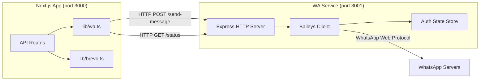

# Design Document: WhatsApp Notifications (wa-notifications)

## Overview

This feature adds WhatsApp notification capabilities to the BMKG Calibration System by introducing a standalone Node.js service (`wa-service/`) that maintains a persistent WhatsApp Web connection via the Baileys library, and a client module in the Next.js app (`lib/wa.ts`) that mirrors the existing `lib/brevo.ts` pattern.

The architecture follows a fire-and-forget, non-blocking pattern: WhatsApp notifications are sent after successful operations but never cause the main API operation to fail. This matches the existing email notification pattern already established in the codebase.

**Key Design Decisions:**
- **Separate service**: WhatsApp Web requires a persistent socket connection that doesn't fit Next.js serverless/edge model. A dedicated Node.js process manages the connection lifecycle.
- **HTTP API bridge**: The Next.js app communicates with the WA service via simple HTTP calls, keeping the integration lightweight and testable.
- **Mirror brevo.ts pattern**: The `lib/wa.ts` client uses the same `{ success, error }` result pattern, never throws, and uses dynamic import style for consistency.
- **Phone normalization in WA service**: The service handles all phone format normalization, keeping the Next.js client simple.

## Architecture



**Request Flow:**
1. API route completes its primary operation (registration, signing, send-to-verifiers)
2. API route calls `sendWhatsApp(phone, message)` from `lib/wa.ts` (fire-and-forget with `void`)
3. `lib/wa.ts` makes HTTP POST to WA service's `/send-message` endpoint
4. WA service normalizes phone number, validates, and sends via Baileys
5. Result is logged but never blocks the caller

## Components and Interfaces

### 1. WA Service (`wa-service/`)

A standalone Node.js + Express application.

**File Structure:**
```
wa-service/
├── package.json
├── tsconfig.json
├── src/
│   ├── index.ts          # Entry point, Express server setup
│   ├── baileys-client.ts # Baileys connection management
│   ├── phone-utils.ts    # Phone number normalization & validation
│   └── routes.ts         # HTTP route handlers
├── auth_info/            # Baileys auth state (gitignored)
└── .env.example
```

**Interfaces:**

```typescript
// POST /send-message
interface SendMessageRequest {
  phone: string;   // Raw phone number (0xxx, 62xxx, or +62xxx)
  message: string; // Plain text message
}

interface SendMessageResponse {
  success: boolean;
  error?: string;
}

// GET /status
interface StatusResponse {
  connected: boolean;
}
```

```typescript
// phone-utils.ts
interface PhoneNormalizationResult {
  valid: boolean;
  normalized?: string; // "62xxxxxxxxxx@s.whatsapp.net"
  error?: string;
}

function normalizePhoneNumber(phone: string): PhoneNormalizationResult;
```

```typescript
// baileys-client.ts
interface BaileysClientManager {
  initialize(): Promise<void>;
  isConnected(): boolean;
  sendMessage(jid: string, text: string): Promise<void>;
}
```

### 2. Next.js WA Client (`lib/wa.ts`)

Mirrors the `lib/brevo.ts` pattern.

```typescript
// lib/wa.ts
export interface SendWhatsAppParams {
  phone: string;   // Phone number from personel.phone
  message: string; // Plain text message
}

export interface SendWhatsAppResult {
  success: boolean;
  error?: string;
}

export async function sendWhatsApp(params: SendWhatsAppParams): Promise<SendWhatsAppResult>;
```

### 3. Message Builders (`lib/wa-messages.ts`)

Pure functions that construct notification message text.

```typescript
// lib/wa-messages.ts
export function buildAccountConfirmationMessage(personnelName: string): string;

export function buildCertificateCompletionMessage(
  certificateNumber: string,
  completionDateTime: string
): string;

export function buildDraftSubmissionMessage(
  certificateNumber: string,
  calibratorName: string
): string;
```

### 4. Integration Points

| API Route | Trigger | Recipients | Message Builder |
|-----------|---------|------------|-----------------|
| `personel/register` | Successful registration | New personnel | `buildAccountConfirmationMessage` |
| `certificate-verification/sign-level-3` | Certificate completed | Penandatangan | `buildCertificateCompletionMessage` |
| `certificates/[id]/send-to-verifiers` | Draft sent | verifikator_1, verifikator_2, verifikator_3, authorized_by | `buildDraftSubmissionMessage` |

## Data Models

### Phone Number Normalization Rules

| Input Format | Transformation | Example |
|---|---|---|
| `0812...` | Replace leading `0` with `62` | `0812345678` → `62812345678` |
| `+62812...` | Remove leading `+` | `+62812345678` → `62812345678` |
| `62812...` | No change | `62812345678` → `62812345678` |

**Validation:** After normalization, the digit-only string must be 10–15 characters long.

**JID Format:** Normalized number + `@s.whatsapp.net` (e.g., `62812345678@s.whatsapp.net`)

### Message Templates

**Account Confirmation:**
```
Halo {name},

Akun Anda telah berhasil dibuat di Sistem Kalibrasi BMKG.

Terima kasih.
```

**Certificate Completion:**
```
Sertifikat Terbit

Sertifikat dengan nomor {no_certificate} telah selesai ditandatangani pada {datetime}.

Terima kasih.
```

**Draft Submission to Verifiers:**
```
Pemberitahuan Verifikasi

Sertifikat {no_certificate} telah dikirim untuk verifikasi oleh {calibrator_name}.

Mohon segera ditindaklanjuti.

Terima kasih.
```

### Environment Variables

| Variable | Service | Description | Default |
|----------|---------|-------------|---------|
| `PORT` | wa-service | HTTP server port | `3001` |
| `WA_SERVICE_URL` | Next.js | Base URL of WA service | — |

### Database Access

No new tables or columns are needed. The feature reads from existing tables:
- `personel.phone` — recipient phone number
- `personel.name` — for message personalization
- `certificate.no_certificate` — certificate number
- `certificate.verifikator_1`, `verifikator_2`, `verifikator_3`, `authorized_by` — verifier IDs

## Correctness Properties

*A property is a characteristic or behavior that should hold true across all valid executions of a system—essentially, a formal statement about what the system should do. Properties serve as the bridge between human-readable specifications and machine-verifiable correctness guarantees.*

### Property 1: Phone number normalization preserves identity

*For any* valid Indonesian phone number provided in any accepted format (`0xxx`, `62xxx`, or `+62xxx`), normalizing the number SHALL produce the same canonical form (`62` prefix, digits only), and the canonical form SHALL always end with `@s.whatsapp.net` when formatted as a JID.

**Validates: Requirements 2.9, 7.1, 7.2, 7.3, 7.4**

### Property 2: Phone number length validation

*For any* phone number string, after normalization, if the digit count is fewer than 10 or greater than 15, the normalization function SHALL return an invalid result with an error description.

**Validates: Requirements 7.5**

### Property 3: WA client never throws

*For any* combination of phone number, message text, and WA service response (including network errors, timeouts, HTTP 4xx/5xx responses, and malformed responses), the `sendWhatsApp` function SHALL return a result object with `{ success: boolean, error?: string }` and SHALL NOT throw an unhandled exception.

**Validates: Requirements 3.1, 3.5, 3.6**

### Property 4: Message builders produce plain text

*For any* valid input parameters (personnel name, certificate number, datetime string, calibrator name), all message builder functions SHALL produce output that contains no HTML tags, no Markdown formatting characters (`*`, `_`, `~`, `` ` ``), and no WhatsApp rich text markers.

**Validates: Requirements 4.4, 5.4, 6.4**

### Property 5: Account confirmation message includes personnel name

*For any* non-empty personnel name string, the `buildAccountConfirmationMessage` function SHALL produce a message that contains the personnel name and the string "Sistem Kalibrasi BMKG".

**Validates: Requirements 4.2, 4.3**

### Property 6: Certificate completion message includes certificate number and formatted datetime

*For any* non-empty certificate number string and any valid datetime string, the `buildCertificateCompletionMessage` function SHALL produce a message that contains both the certificate number and the datetime string.

**Validates: Requirements 5.2, 5.3**

### Property 7: Draft submission message includes certificate number and calibrator name

*For any* non-empty certificate number string and any non-empty calibrator name string, the `buildDraftSubmissionMessage` function SHALL produce a message that contains both the certificate number and the calibrator name.

**Validates: Requirements 6.2, 6.3**

### Property 8: Fault isolation in multi-recipient send

*For any* list of recipients where some sends succeed and some fail, the notification dispatch SHALL attempt to send to ALL recipients regardless of individual failures, and the count of attempted sends SHALL equal the count of recipients with phone numbers.

**Validates: Requirements 6.7**

## Error Handling

### WA Service Error Handling

| Scenario | HTTP Status | Response | Behavior |
|----------|-------------|----------|----------|
| Missing/empty `phone` | 400 | `{ success: false, error: "Phone number is required" }` | Reject immediately |
| Missing/empty `message` | 400 | `{ success: false, error: "Message is required" }` | Reject immediately |
| Invalid phone length | 400 | `{ success: false, error: "Invalid phone number format" }` | Reject after normalization |
| Not connected to WhatsApp | 503 | `{ success: false, error: "WhatsApp not connected" }` | Reject, client should retry later |
| Baileys send failure | 500 | `{ success: false, error: "<error details>" }` | Log error, return failure |
| Valid request, connected | 200 | `{ success: true }` | Message sent |

### Next.js Client Error Handling

| Scenario | Behavior |
|----------|----------|
| `WA_SERVICE_URL` not configured | Return `{ success: false, error: "Missing WA_SERVICE_URL configuration" }` |
| Network error (ECONNREFUSED, timeout) | Log warning, return `{ success: false, error: "<message>" }` |
| WA service returns non-200 | Log warning with status and body, return `{ success: false, error: "<message>" }` |
| Missing phone in personel record | Log warning with personel ID, skip send |
| Successful send | Return `{ success: true }` |

### Non-Blocking Guarantee

All WhatsApp notification calls in API routes use fire-and-forget pattern:
```typescript
// Fire-and-forget — never awaited in the response path
void sendWhatsAppNotification(phone, message);
```

This ensures:
- The API response is never delayed by WA service latency
- WA service downtime never causes API failures
- Individual send failures are logged but don't propagate

## Testing Strategy

### Unit Tests (Jest)

**WA Service:**
- `phone-utils.ts`: Test normalization for all input formats, boundary lengths, invalid inputs
- `routes.ts`: Test request validation (missing fields, empty fields)
- Mock Baileys client for route handler tests

**Next.js Client:**
- `lib/wa.ts`: Test with mocked fetch — success, network error, HTTP errors, missing env var
- `lib/wa-messages.ts`: Test all message builders with various inputs

### Property-Based Tests (fast-check)

The project already has `fast-check` as a dev dependency. Property tests will use minimum 100 iterations.

**Phone normalization properties:**
- Generate random digit strings with various prefixes → verify canonical output format
- Generate strings of various lengths → verify validation boundaries
- Tag: `Feature: wa-notifications, Property 1: Phone number normalization preserves identity`

**WA client resilience:**
- Generate random error responses → verify never throws
- Tag: `Feature: wa-notifications, Property 3: WA client never throws`

**Message builder properties:**
- Generate random names/numbers → verify content inclusion and plain text format
- Tag: `Feature: wa-notifications, Property 4-7: Message builder correctness`

**Fault isolation:**
- Generate random success/failure patterns for multi-send → verify all recipients attempted
- Tag: `Feature: wa-notifications, Property 8: Fault isolation in multi-recipient send`

### Integration Tests

- WA service startup with mocked Baileys (verify Express routes are registered)
- End-to-end flow: Next.js client → WA service → mocked Baileys (verify message delivery)
- Verify non-blocking behavior: API routes succeed even when WA service is down

### Test File Locations

```
wa-service/
├── src/__tests__/
│   ├── phone-utils.test.ts        # Unit + property tests
│   ├── routes.test.ts             # Unit tests with mocked Baileys
│   └── phone-utils.property.test.ts  # Property-based tests

lib/
├── __tests__/
│   ├── wa.test.ts                 # Unit + property tests for client
│   └── wa-messages.test.ts        # Unit + property tests for message builders
```
